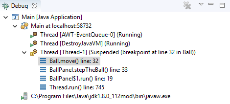
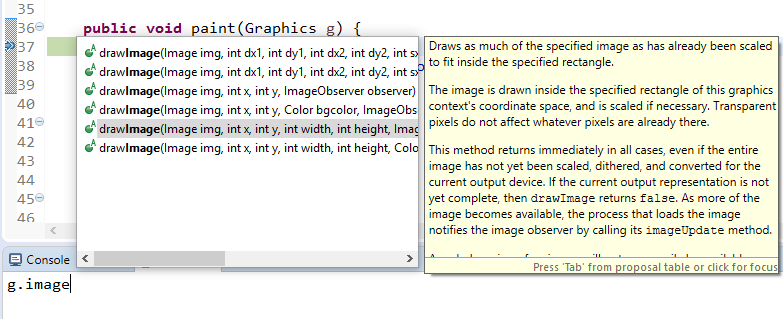
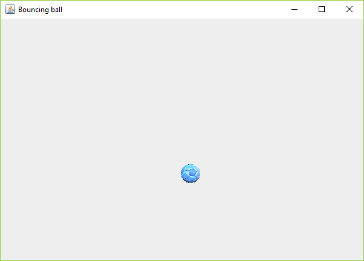
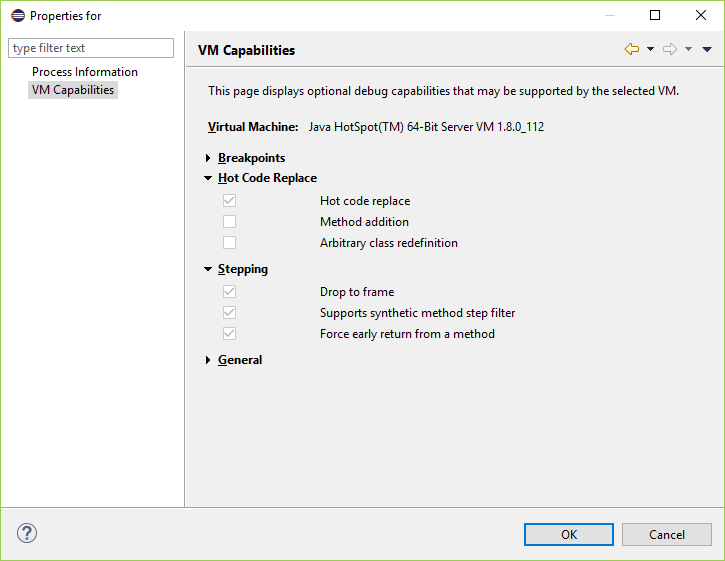
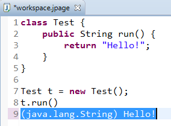
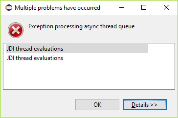
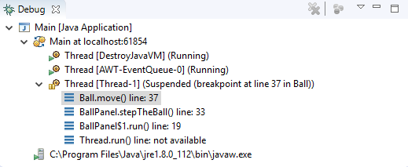
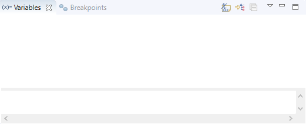
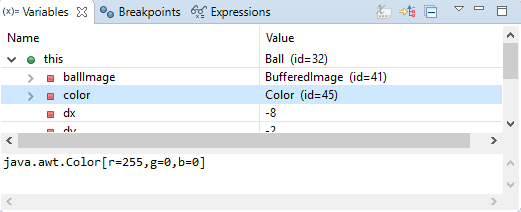
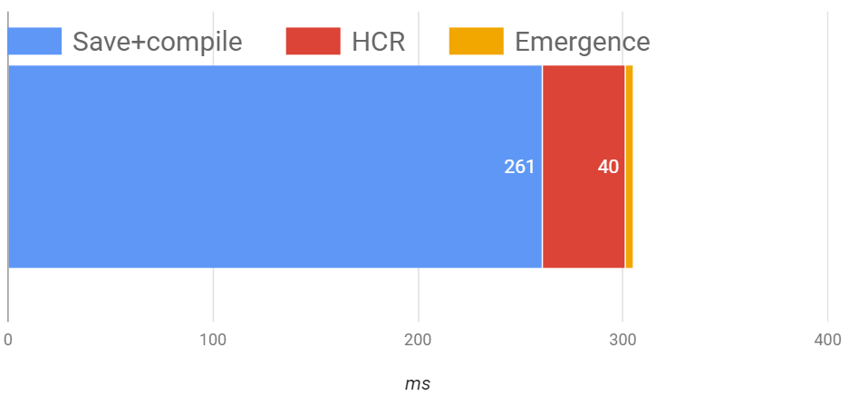

# Live Programming Seminar
- Your Name: Daniel Stolpe
- Your Topic: Eclipse Debugger (Java)

## About the System itself
Eclipse provides IDEs and platforms for many languages and architectures. Eclipse is famous for their Java IDE, C/C++, JavaScript and PHP IDEs built on extensible platforms for creating desktop, Web and cloud IDEs. The Eclipse IDEs are open-source. @RefKey[EclipseOrg]

Eclipse was inspired by the Smalltalk-based VisualAge family of IDEs. @RefKey[EclipseFAQWhereFrom]

The Eclipse Project was originally created by IBM in November 2001 and supported by a consortium of software vendors. The Eclipse Foundation was created in January 2004 as an independent not-for-profit corporation to act as the steward of the Eclipse community. @RefKey[EclipseOrgOrg]

The Java Debugger is part of the "Java Development Tools (JDT) Debug" project. It is implemented on top of the language independent "debug model" provided by the platform debugger which provides language independent facilities for launching programs, source code lookup, breakpoints and debugging UI. @RefKey[EclipseDebug]

Talking about the Eclipse Debugger in the following always relates to the Java Debugger.

### System boundaries
We focus on parts of the Eclipse Debugger, which are facilitating liveness. These are the graphical tools allowing to inspect and modify runtime state, to modify runtime behavior and to evaluate code snippets at runtime. Although these features depend on the available features of the underlying JVM, we focus only on the Eclipse Debugger implementation.

The "Scrapbook Page" does not directly belong to the Eclipse Debugger, but we also look at that concept and implementation, because it fits in the context of liveness and builds upon the same code like some tools of the Eclipse Debugger.

### Context
The Eclipse Debugger is used in software development by a single person in front of one computer. It is often used by professional developers in companies, but also by amateurs and students at home, in university classes or schools.

### General Application Domain
The Eclipse Debugger is used for debugging Java applications graphically. The user wants to understand the runtime behavior of an application, mostly to find bugs. This is supported by graphical tools to set Breakpoints, inspect variables and watch expressions. With its liveness features like Hot Code Replace, code evaluation and variable modification it can also be used for limited experimental development and iterative trial-and-error coding.
The debugged application can run locally or on a remote computer.

### Design Goals of the System
The Eclipse Debugger is mainly designed to interactively debug any kind of Java applications to find bugs faster and increase productivity. Therefore, the different graphical tools to inspect runtime state etc. are pluggable to allow customization to keep only those tools in direct view of the programmer which he needs for his current task.

Many typical features needed to debug an application, like showing the current value of a variable or setting Breakpoints, are also available directly in the code editor via mouse interaction or keyboard shortcuts. This shall help the the programmer to stay focused on one view.

To allow some experimental development and iterative-trial-and-error coding with Java, the Eclipse Debugger provides Hot Code Replace to change runtime behavior without the need to restart a program. This shall also improve productivity by avoiding lots of restarts, especially for long running programs like servers or other applications with significant boot times or important runtime state.

Scrapbook pages allow additional interactive code snippet evaluation. @RefKey[EclipseDebug]

The Eclipse Debugger is not designed to develop a whole application at runtime.

### Type of System
The Eclipse Debugger is an interactive, graphical debugger for Java applications.

---

## Workflows
Although the Eclipse Debugger is not designed to develop a whole application at runtime, we try to develop it as live as possible in the following exemplary workflow. Therefore, we keep the application running as long as possible while writing the source code. This helps to illustrate the possibilities and limitations of live programming with the Eclipse Debugger.

We use a Java Virtual Machine version 1.8.0 update 112 for running Eclipse Neon.1a Release (4.6.1) and the sample application we develop.

### Example Workflow
A good example to demonstrate live programming features and its limitations is creating a bouncing ball simulation with Java 2D drawing features.

1. We start Eclipse
2. We choose from the menu bar "File" > "New" > "Java Project"
3. We choose a project name, e.g. "BouncingBall" and click "Finish"
4. In the "Package Explorer" we right-click on our new project "BouncingBall" and choose "New" > "Class". In the opening Dialog we enter the name "Main" and select the checkbox "public static void main(String[] args)" and click "Finish"
5. We add three more classes, but leaving the checkbox for creating a main method unchecked. The classes are "Ball", "BallPanel" and "BallDialog"
6. We select the class "Ball" and add some fields and methods to it by adjusting (in the following, "adjusting" always means writing the code and saving the changes by pressing *Ctrl+S*) the code like this:
  ```java
  import java.awt.Color;
  import java.awt.Graphics;
  import java.awt.Point;

  public class Ball {
    private Point location;
    private int radius;
    private Color color;

    public Ball(Point l){
        location = l;
        color = Color.RED;
        radius = 16;
    }

    public Point getLocation() {
        return location;
    }

    public int getRadius() {
        return radius;
    }

    public Color getColor() {
        return color;
    }
  }
  ```
By default, "Build Automatically" is enabled in Eclipse, so that saving changes triggers an incremental build process in the background automatically.

7. Now we want to draw a ball, so we need some code to create a Window in Java. We adjust the class "Main" to:
  ```java
  import javax.swing.JFrame;

  public class Main {

    public static void main(String[] args) {
        javax.swing.SwingUtilities.invokeLater(new Runnable() {
            public void run() {
                createAndShowGUI();
            }
        });
    }
    
    private static void createAndShowGUI() {
        JFrame frame = new JFrame("Bouncing ball");
        frame.setDefaultCloseOperation(JFrame.EXIT_ON_CLOSE);
        
        BallPanel ballPanel = new BallPanel();
        ballPanel.setOpaque(true);
        frame.setContentPane(ballPanel);

        frame.pack();
        frame.setLocationRelativeTo(null);
        frame.setVisible(true);
    }
  }
  ```

8. We also adjust the class "BallPanel" to:
  ```java
  import java.awt.Dimension;
  import java.awt.Point;
  import javax.swing.JPanel;

  public class BallPanel extends JPanel {
    private Ball ball;
    
    public BallPanel() {
      setPreferredSize(new Dimension(600, 400));
      ball = new Ball(new Point(50,50));
    }
  }
  ```

9. We right-click on the class "Main" and select "Debug As" > "1 Java Application". A Window opens, but no ball is visible yet.
10. We need to add the actual drawing methods. Keeping the window open, we switch to the Eclipse IDE and add the following method to "BallPanel":
    ```java
      @Override
      public void paint(Graphics g){
          super.paint(g);
          ball.paint(g);
      }
    ```
    Although we have not saved our changes yet, the Eclipse syntax check detects "Graphics" as an unknown type and underlines it red.

    

    So we press *Ctrl+Shift+O* to organize our imports and select "java.awt.Graphics". We save our changes which leads to the following pop-up:

    

    We click "Terminate" to close the running application, because we need to add more methods. We still need to implement the paint-method for the class "Ball". We hover with the mouse cursor over the red-underlined code snippet "ball.paint(g);" and select from the displayed pop-up "Create method ...". Now we can add the following code to the auto generated method and save the changes:
    ```java
      g.setColor(getColor());
      g.fillOval(100, 100, 50, 50);
    ```

11. We run the application again in "Debug"-mode by pressing "F11". Now, the ball is drawn:

    

    We want to adjust the `paint(...)` method, so that the actual properties of the ball are used to draw and not the hard coded values. So we keep the window open again and switch to the IDE. We change the "paint"-method to:
    ```java
      g.setColor(getColor());
      g.fillOval(location.x - radius, location.y - radius, 2 * getRadius(), 2 * getRadius());
    ```
    We save and switch to our ball-window. We can not see any change, because the paint method was not triggered again yet. We enforce a repaint by grabbing the edge of the window with the mouse and make it a bit larger. Now we see the ball changing in size and position.

12. We want to make the ball start moving and adjust the "BallPanel" code to:
  ```java
  [...]
  public BallPanel() {
      setPreferredSize(new Dimension(600, 400));
      ball = new Ball(new Point(50,50), 8, 2);
      
      new Thread(new Runnable() {
        @Override
        public void run() {
          while (true) {
            if (BallPanel.this.getParent().isVisible()) {
              BallPanel.this.stepTheBall();
            }

            try {
              Thread.sleep(20);
            } catch (InterruptedException e) {
              e.printStackTrace();
            }
          }
        }
    }).start();
  }
    
  public void stepTheBall() {
    ball.move();
    repaint();
  }

  [...]
  ```
  When saving, the notification pops up again, that Hot Code Replace is not possible. We terminate the running application.
  We adjust the code of "Ball" to:
  ```java
  [...]
  public class Ball {
    private Point location;
    private int radius;
    private int dx, dy;
    private Color color;

    public Ball(Point l, int directionX, int directionY){
        location = l;
        color = Color.RED;
        radius = 16;
        dx = directionX;
        dy = directionY;
    }

    public void move(){
        getLocation().translate(dx, dy);
    }

  [...]
  ```

13. We run the application again in "Debug"-mode by pressing "F11". We see the ball moving from the top left corner, to the right and leaving the window. To bounce the ball from the right side, we adjust the "stepTheBall"-method:
    ```java
    public void stepTheBall() {
      ball.move();
      
      Point position = ball.getLocation();

      if (position.x > getWidth()) {
        ball.recflectVertical();
      }

      repaint();
    }
    ```
    After saving a pop-up appears:

    

    We choose "Yes". In the Debug-Perspective we can hover over the red-underlined code snippet `ball.recflectVertical();` to get the info, that this method is missing in class "Ball". We click on "Create method ...". In the class "Ball", we implement the method as follows:
    ```java
    public void recflectVertical() {
        dx = -dx;       
    }
    ```
    Saving leads again to the information that Hot Code Replace is not possible when adding methods. This time, we click "Restart", which terminates our running application and starts a new one with the new codebase afterwards. The ball bounces from the right side, but not from the others.

14. We add the remaining checks:
  ```java
  public void stepTheBall() {
      ball.move();
      
      Point position = ball.getLocation();

      if (position.x > getWidth() || position.x < 0) {
        ball.recflectVertical();
      }

      if (position.y > getHeight() || position.y < 0) {
        ball.recflectHorizontal();
      }
      repaint();
  }
  ```
  and add `recflectHorizontal()` to "Ball":
  ```java
  public void recflectHorizontal() {
      dy = -dy;       
  }
  ```
  Again we have to restart the application. Now the ball bounces from all sides.

15. The bouncing does not look very nice, because the reflection is done based on the top left corner of the ball. We adjust the code of `stepTheBall()` to:
  ```java
  if (position.x + ball.getRadius() > getWidth() || position.x - ball.getRadius() < 0) {
    ball.recflectVertical();
  }

  if (position.y + ball.getRadius() > getHeight() || position.y - ball.getRadius() < 0) {
    ball.recflectHorizontal();
  }
  ```
  The changes are immediately visible without the need to restart.

16. Now, we want to change the direction vector of our ball, so that it moves very slow, but without terminating the application. We place a breakpoint in the method `move()` by double clicking next to the line number. The debugger immediately holds at the breakpoint:

    

    An overview which thread is currently halting at a Breakpoint together with the corresponding stack trace is visualized in den "Debug View":

    

    Now, we hover over the variables `dx` and `dy` to view their current values:

    

    We could also select `dx`, right-click the selection and click "Watch" in the context menu. This will open the "Expression View", where we can see the value of `dx`. However, we cannot change it.

    

    To change the value of `dx`, we click on "Window" > "Show View" > "Variables" in the menu bar. In this view we expand "this" to see all fields of the current "Ball" instance:

    

    Now we can double click into the "Value" column and change the value of `dx` to `1`. Then we remove the breakpoint by double clicking next to the line number in the editor and press "F8" to resume the execution.
    The ball is moving very slow now.

17. Finally, we want to replace the single colored ball with an image of a football. We switch back to the "Java Perspective" and add a PNG image to our Java project's source folder named `ball.png`.

    

    At the moment, we do not know exactly, how to load and draw an image in Java and want to try out some ideas. We switch back to the "Debug Perspective" and set a breakpoint at `g.setColor(getColor());` in method `public void paint(Graphics g)` of class `Ball.java`.
    We press "F11" to start debugging.
    The execution stops at our breakpoint. To get a scrapbook- or workspace-like environment, we click in the menu bar "Window" > "Show View" > "Display". In this view we have access to all variables available in the context of the current executed method. We type `g.` and get some code completion suggestions. We type `g.image` to find a method which can draw an image.

    

    We decide on the fifth entry which needs an instance of `Image`, the drawing position and width and height of the image.
    Now we need an instance of `Image`. We know that there is a class `ImageIO` which can read images. We type `ImageIO` and trigger code completion by pressing *Ctrl+Space* to get the full qualified name `javax.imageio.ImageIO` of the class. We trigger code completion again by typing `javax.imageio.ImageIO.read`. There is a method accepting an `InputStream`, which we will use.

    

    To get an input stream for our image `ball.png` we can use the system class loader by typing `Ball.class.getResourceAsStream("ball.png")`. To test this code snippet, we select the whole line of code we want to execute and press *Ctrl+Shift+D*. The result is:

    

    Now, that we have a valid input stream, we can test drawing an image. We combine our code snippets to `g.drawImage(javax.imageio.ImageIO.read(Ball.class.getResourceAsStream("ball.png")), 10, 10, null)`, select the line of code and press *Ctrl+Shift+D*.

    

    The result is `(boolean) true` which means, that the drawing was successful. We switch to our running application but cannot see any image of a ball, because the actual drawing is not done yet. We press "F8" to continue execution. The program stops again at our breakpoint at `g.setColor(getColor());`. We switch again to our running application and now we see the image of the ball drawn at position (10, 10).

    

    Now we can replace the actual drawing code of method `public void paint(Graphics g)` with `g.drawImage(javax.imageio.ImageIO.read(Ball.class.getResourceAsStream("ball.png")), location.x - radius, location.y - radius, 2 * getRadius(), 2 * getRadius(), null);`.
    The code is not valid yet and by hovering over the red-line code we see that a try-catch-statement is needed. We add it by selecting "Surround with try/catch".

    

    The drawing code looks like this:
    ```java
    public void paint(Graphics g) {
      try {
        g.drawImage(javax.imageio.ImageIO.read(Ball.class.getResourceAsStream("ball.png")), location.x - radius, location.y - radius, 2 * getRadius(), 2 * getRadius(), null);
      } catch (IOException e) {
        e.printStackTrace();
      }
    }
    ```
    Now we remove the breakpoint, save our changes and press "F8" to resume execution. The application is still running and we can switch to it and see the bouncing image of a ball.
    

### Which activities are made live by which mechanisms?
Step 11 of the example workflow shows the first liveness activity. The program is running in "Debug"-mode and we change code in the body of the `paint(...)` method. Saving these changes triggers Hot Code Replace (HCR). The method body of the `paint(...)` is replaced without restarting the application. But the change is only visible when the `paint`-method is triggered e.g. by resizing the window.

In step 15, HCR is triggered again by saving a Java file. This change is immediately visible, due to stepping implemented via a separate Thread which enforces a repaint every 20ms, which provides immediate visual feedback for the programmer.

In step 16, a Breakpoint pauses the execution of threads at a specific line of code. In the "Debug View" we see an overview of all running and paused threads. The Eclipse Debugger allows us to inspect the state of the stack trace of a paused thread, e.g. by hovering over a variable in the code editor to see its value in a pop-up window. If the value is an object, it is displayed via its `toString()` method. Furthermore the object's instance variables are displayed in a foldable tree structure, but without the ability to change them.
Next, we open the "Expressions View" to watch the resulting value of arbitrary valid Java expressions as long as the thread is paused. We also open a "Variables View" to examine all local variables available in the current stack frame including `this`. 

In step 16 we also modify runtime state via the "Variables View".

In step 17 we evaluated code snippets to explore the File-IO- and Image-drawing-API. Runtime state manipulation and code evaluation via the Eclipse Debugger are only possible because a context (variables of the current stack frame) is provided when pausing execution.

### Integration of live activities into overall system
The Eclipse Debugger is seamlessly integrated into the Eclipse IDE. Eclipse provides a "Debug Perspective" consisting of a source code editor in the center, surrounded by different views to inspect VM-threads, variables and console output.


The source code editor is the same as in the default "Java Perspective", i.e. when halting at a Breakpoint, you can inspect variables like in the "Debug Perspective" in step 16 by hovering over them with the mouse cursor. Debugging and using liveness features like Hot Code Replace is independent of the current "Perspective".

### Limitations
#### Conceptual limitations
A conceptional limitation to live programming with the Eclipse Debugger (or Java in general) is the differentiation between running an application in "Run"- or "Debug"-mode. When starting in "Run"-mode, no debugging features are available, i.e. Hot Code Replace or state inspection/modification via Breakpoints is not possible.

Another limitation is based on the requirement, that we need to halt a thread at a Breakpoint, to inspect/modify runtime state. Finding the relevant context to put that Breakpoint can be difficult. E.g. if we want to change the speed of the bouncing ball, we have to find the relevant lines of code which provide access to a reference of the ball. When found, execution still has to reach this Breakpoint. This might be no problem in a small application, but the more complex a system becomes, the more difficult it will be to find the relevant lines of code.

#### Hot Code Replace limitations
The default JVM implementations (e.g. HotSpot and OpenJDK) of Java 8, which are optimized for speed and consistency, do not implement the full feature-set described in the JVM HotSwap specification. @RefKey[HotSwapSpec]

The supported features can be inspected in Eclipse by opening the properties of a running VM:



We see that Hot Code Replace is supported, but method addition or arbitrary class redefinition is not supported by that Java HotSpot VM implementation.

Further, HCR is also not possible when changing code of the last method on the stack (e.g. the main-method), because this stack frame cannot be popped to reenter the modified method afterwards.

The project DCEVM (Dynamic Code Evolution VM) @RefKey[DCEVM] shows an approach to eliminate these limitations. Their developers promise:
>Dynamic Code Evolution VM allows unlimited redefinition of loaded classes at runtime by patching the Java default VM. @RefKey[DCEVM]

However the advanced liveness feature-set has a downside:
>DCEVM executes deoptimization (purge of code cache) after any class redefinition. It decreases JVM's performance (after redefinition). This is especially a problem on large scale projects with significant number of classes. @RefKey[DCEVMGitHub]

#### State inspection/modification limitations
State inspection and modification done by "Variables View" or "Expressions View" is depending on a context. We need to explicitly place a Breakpoint to pause a thread. Otherwise they display no state.

#### Code evaluation limitations
Like state inspection/modification, code evaluation is only possible when a context is provided.

If we want to do some trial-and-error coding without starting a dummy Java application in "Debug"-mode and placing a Breakpoint manually, we can use a "Scrapbook Page". It provides the same liveness features as the "Display View", but can be used as a standalone workspace to evaluate Java code. We click on "File" > "New" > "Other..." and in the wizard we select "Java" > "Java Run/Debug" > "Scrapbook Page" and click "Next". We enter a file name, e.g. "workspace" and click "Finish". An empty "Scrapbook Page" opens. We can enter arbitrary Java Code and evaluate it by selecting the code and pressing *Ctrl+Shift+D*.



### What happens when the live parts of the system fail/break?
1. What happens when the application under development causes an exception? How does the system handle these exceptions (provide debugger, stop execution, stop rendering, ...)? Does the liveness extend to these exceptions?

    Java has a built-in exception handling, allowing the Eclipse Debugger to halt execution when an unhandled exception is thrown in "Debug"-mode (e.g. an ArithmeticException caused by "division by zero"). If the the error can be fixed by modifying state via the "Variables View" or behavior via HCR, execution can be resumed.
    If HCR fails due to running into the limitations described before, e.g. adding a method, the Eclipse Debugger handles this exception by letting the developer choose from three options: Continue, Terminate and Restart.
    
    
    
      + Continue
      The developer can safely continue the execution using the old, unchanged codebase. The changes made will not become active until restarting the debugging session and therefore the whole application.

      + Terminate
      Stops the current debugging session and terminates the application.

      + Restart
      Restarts the debugging session, so that all code changes will be included in the new session, but all runtime state is lost.

2. How can the system itself break? What happens when there is a failure in the system/tool itself?
    In some cases, when saving invalid Java code (like invalid method signatures), the Eclipse Debugger is unable to properly handle these exceptions and can only notify the user via the Eclipse Debugger that something went wrong.
    
    
    
    In such a case, the application freezes and you can only terminate the running application via the Eclipse Debugger.
    The Debugger itself and the Eclipse IDE are still intact. Even if the application crashes on operating system level, the Eclipse IDE stays unharmed, because IDE an debugged application are running in separate JVMs and are therefore separate OS processes.


### Left out features
Which features of the system were not described and why were they left out?

- Remote Debugging
  The Eclipse Debugger allows us to debug programs remotely, e.g. a Java application running in an application server. The underlying concepts for debugging such an application remotely with the Eclipse Debugger are the same for debugging an application running from inside the Eclipse IDE. Therefore we left this feature out.

---

## Models

### Mutable or immutable past
The Eclipse Debugger is an immutable past tool. HCR only allows to replace behavior (class methods) that will be executed from now on. If you replace code of a method currently executed, the stack frame will be reset. Side-effects of already executed code cannot be reverted automatically.

### Tanimoto's Level of Live Programming

- Behavior manipulation by HCR - Liveness level 4
  The behavior of the running application is immediately changed after the user made the change. The application is kept running. A valid change to a class happens only when a user saves the class' source file from inside the Eclipse IDE. A keystroke is not a valid change to a source file.

- Code evaluation - Liveness level 4
  Code evaluation is only possible when providing a context by pausing a thread of the application in "Debug"-mode. A thread is paused when reaching a Breakpoint. All other application threads and the Eclipse Debugger are kept running. When evaluating code snippets, the result is displayed immediately as long as the evaluated snippet has a sub-second execution time.
  We argue, that this is still liveness level 4, because Tanimoto writes:
  > In level 4, the computer wouldn’t wait but would keep running the program, modifying the behavior as specified by the programmer as soon as changes were made. @RefKey[Tanimoto2013PEL]
  
    In general the Java program is kept running and the program evaluates the snippets as soon as the programmer triggers the evaluation by pressing a keyboard shortcut.
  
- Runtime state manipulation - Liveness level 4
  The argumentation for liveness level 4 is the same as for code evaluation. Runtime state manipulation is only possible when providing a context by pausing a thread, but the application and the Eclipse Debugger are kept running. A state modification is applied as soon as the programmer triggers the change, for example via the "Variables View".

### Steady Frame
A Steady Frame is defined as:
>[...] a way of organizing and representing a system or activity, such that (I) relevant variables can be seen and/ or manipulated at specific locations within the scene (the framing part), and (II) these variables are defined and presented so as to be constantly present and constantly meaningful (the steady part). @RefKey[Hancock2003RTP]

The "Debug View" is a Steady Frame, because it displays constantly meaningful information about the state of the running application and its threads.


When halting one thread at a Breakpoint, additional information, like the stack trace, are available.



The "Variables View" and "Expression View" of the Eclipse Debugger can be seen as *frames* based on the formal definition. However, they are only *steady* when a context is provided, i.e. when halting at a Breakpoint.
Without a context, these views do not show any runtime state information.
The empty "Variables View":



The "Expressions View" without values:


When halting at a Breakpoint, they turn into Steady Frames.
The filled "Variables View":



The "Expressions View" with values:


When the programmer expands the tree structure to explorer variables and values, this expansion state is kept when stepping through a method. Only when we step into another method or return from it, the tree is collapsed again.

### Impact on distances

- Temporal
    Changing behavior by applying Hot Code Replace has no temporal distance. The adaptation time is less than 1s (see chapter *Benchmarking*).

    Changing state via the "Variables View" has no temporal distance. Modifying a variable in this view is done in less than 100ms (see chapter *Benchmarking*).

    Evaluating code snippets using the "Display View", "Scrapbook Page" or the code editor's in-place features has no temporal distance regarding the adaptation time. The emergence time is depending on the execution time of the evaluated code snippet only.

    In all cases, the Eclipse Debugger allows the user to recognize a causality between triggering the change and seeing the effects.

- Spatial and Semantic
    In the Eclipse IDE, all views are pluggable. This implies that the spatial and semantic distance among different views is highly depending on the graphical arrangement.
    In the default setup of the "Debug Perspective", the code editor is placed in the center, the "Debug View" to inspect the state of VM-Threads in the upper left and all the other state inspection tools like "Variables View" and "Expressions View" are grouped in a tab view in the upper right corner. The "Display View" is grouped in a tab view at the bottom. This approach already implies a spatial distances by physically separating these tools. The programmer has to deal with a cognitive "ping-pong" effect @RefKey[Ungar1997DEI].
    The "Variables View" for example allows to inspect and change the values of available variables at runtime, but the programmer needs to move the focus from the editor to a different view, find the corresponding variable entry in the tree list and move the focus back to the code.
    
    The Eclipse Debugger tries to reduce these spatial distance by integrating parts of the features of these views directly into the code editor.
    To inspect a variable faster and with reduced spatial and semantic distance, the programmer can hover with the cursor over a single variable in the code editor to spawn an inspection pop-up window in-place.
    However, the inspection is read-only. The programmer still has a semantic and spatial distance, when he wants to change the value after inspecting it.

    To evaluate code snippets, the programmer can add the snippet to the "Expressions View" or evaluate it in the "Display View" with some spatial and semantic distance. Again, to reduced these distances, the evaluation and result-printing can be done directly in the code editor by selecting a code snippet and pressing a keyboard shortcut.

    On a different level, spatial distances exists between the Eclipse Debugger and the running graphical Java application itself. When the IDE is in full-screen mode, you have to permanently switch between application and Debugger, bringing the one or the other window to front.
    This strict separation between Debugger and application causes also a huge semantic distance. To inspect state of the running application, the programmer needs to find the relevant code snippet to place a Breakpoint. Then the application still needs to reach this Breakpoint to provide the context for state inspection.

    A large semantic distance exists regarding the differentiation between starting an application in "Run"- or "Debug"-mode. Only in "Debug"-mode the programmer can debug an application and make use of the liveness features. If a programmer is not used to always start an application in "Debug"-mode, a restart is needed to enable debugging features when needed.

---

## Implementing Liveness

### Extend of liveness in technical artifacts
The liveness of the Eclipse Debugger is implemented in different layers. At the lowest level, the JVM defines a Java Platform Debugger Architecture (JPDA) for debuggers in development environments @RefKey[JPDA]. The Eclipse Platform Debugger builds upon these interfaces to provide language independent facilities for launching programs, source code lookup, breakpoints and debugging UI @RefKey[EclipseDebug]. At the highest level, the Eclipse Java Debugger implements the language specific part.

### Implementations of single activities
The sample code snippets shown in the following belong to the Eclipse git repository `git://git.eclipse.org/gitroot/platform/eclipse.platform.releng.aggregator.git` and its submodules with revision tag `Y20170105-1040`.
We simplified the code snippets to highlight the most important parts by leaving out unimportant lines (indicated by '...'). These snippets are only a glimpse into the complex implementation of the Eclipse Debugger and we do not claim it to be complete.

#### Hot Code Replace
Changing a method's body and saving the corresponding class file triggers a recompilation of the file. The resulting bytecode is submitted via a debug channel to the JVM of the running application. There, the bytecode of the affected method body is replaced on the fly. No restart is required.


HCR has been specifically added as a standard technique to Java to facilitate experimental development and to foster iterative trial-and-error coding. HCR is reliably implemented only on 1.4.1 VMs and later. @RefKey[EclipseFAQHCR]

**Abstract form**
Hot Code Replace is a debugging technique whereby a Java Debugger transmits new class files over the debugging channel to another JVM.

**Implementation reference**
The following code snippet shows the method `redefineTypesJDK` which does the actual call to the JVM to replace bytecodes (`vm.redefineClasses(typesToBytes);`). It is part of the class `JavaHotCodeReplaceManager` in package `org.eclipse.jdt.internal.debug.core.hcr`.
Corresponding Java file: http://git.eclipse.org/c/gerrit/jdt/eclipse.jdt.debug.git/tree/org.eclipse.jdt.debug/model/org/eclipse/jdt/internal/debug/core/hcr/JavaHotCodeReplaceManager.java?h=Y20170105-1040

```java
/**
 * Replaces the given types in the given JDK-compliant debug target.
 * 
 * This method is to be used for JDK hot code replace.
 */
private void redefineTypesJDK(JDIDebugTarget target, List<IResource> resources,
    List<String> qualifiedNames) throws DebugException {
  if (target.supportsJDKHotCodeReplace()) {
    target.setHCROccurred(true);
    Map<ReferenceType, byte[]> typesToBytes = getTypesToBytes(target, resources,
        qualifiedNames);
    try {
      VirtualMachine vm = target.getVM();
      if (vm == null) {
        target.requestFailed(
            JDIDebugHCRMessages.JavaHotCodeReplaceManager_Hot_code_replace_failed___VM_disconnected__2,
            null);
      }
      vm.redefineClasses(typesToBytes);
    } catch (...) {
      ...
    }
  } else {
    target.notSupported(JDIDebugHCRMessages.JavaHotCodeReplaceManager_does_not_support_hcr);
  }
}
```

The next code snippet shows the method `doHotCodeReplace` which calls `redefineTypesJDK` shown above. It also notifies listeners, if HCR has succeeded or failed. It is also part of the class `JavaHotCodeReplaceManager`

```java
/**
 * Perform a hot code replace with the given resources. For a JDK 1.4
 * compliant VM this involves:
 * <ol>
 * <li>Popping all frames from all thread stacks which will be affected by
 * reloading the given resources</li>
 * <li>Telling the VirtualMachine to redefine the affected classes</li>
 * <li>Performing a step-into operation on all threads which were affected
 * by the class redefinition. This returns execution to the first (deepest)
 * affected method on the stack</li>
 * </ol>
 * For a J9 compliant VM this involves:
 * <ol>
 * <li>Telling the VirtualMachine to redefine the affected classes</li>
 * <li>Popping all frames from all thread stacks which were affected by
 * reloading the given resources and then performing a step-into operation
 * on all threads which were affected by the class redefinition.</li>
 * </ol>
 * 
 * @param targets
 *            the targets in which to perform HCR
 * @param resources
 *            the resources which correspond to the changed classes
 */
private void doHotCodeReplace(List<JDIDebugTarget> targets, List<IResource> resources,
    List<String> qualifiedNames) {
  ...
  while (...) {
    JDIDebugTarget target = ...
    List<IThread> poppedThreads = new ArrayList<IThread>();
    target.setIsPerformingHotCodeReplace(true);
    try {
      boolean framesPopped = false;
      if (target.canPopFrames()) {
        // JDK 1.4 drop to frame support:
        // JDK 1.4 spec is faulty around methods that have
        // been rendered obsolete after class redefinition.
        // Thus, pop the frames that contain affected methods
        // *before* the class redefinition to avoid problems.
        try {
          attemptPopFrames(target, resourcesToReplace,
              qualifiedNamesToReplace, poppedThreads);
          framesPopped = true; // No exception occurred
        } catch (...) {
          ...
        }
      }
      ...
      if (target.supportsJDKHotCodeReplace()) {
        redefineTypesJDK(target, resourcesToReplace,
            qualifiedNamesToReplace);
      } else if (target.supportsJ9HotCodeReplace()) {
        redefineTypesJ9(target, qualifiedNamesToReplace);
      }
      if (containsObsoleteMethods(target)) {
        fireObsoleteMethods(target);
      }
      try {
        if (target.canPopFrames() && framesPopped) {
          // Second half of JDK 1.4 drop to frame support:
          // All affected frames have been popped and the classes
          // have been reloaded. Step into the first changed
          // frame of each affected thread.
          // must re-set 'is doing HCR' to be able to step
          target.setIsPerformingHotCodeReplace(false);
          attemptStepIn(poppedThreads);
        } else {
          // J9 drop to frame support:
          // After redefining classes, drop to frame
          attemptDropToFrame(target, resourcesToReplace,
              qualifiedNamesToReplace);
        }
      } catch (...) {
        ...
      }
      fireHCRSucceeded(target);
    } catch (DebugException de) {
      // target update failed
      fireHCRFailed(target, de);
    }
    // also re-set 'is doing HCR' here in case HCR failed
    target.setIsPerformingHotCodeReplace(false);
    target.fireChangeEvent(DebugEvent.CONTENT);
  }
  ...
}
```

Saving changes by pressing a keyboard shortcut (which triggers Hot Code Replace in the end) is done in the class `SaveHandler`. This class is used as an entry point to measure HCR performance in chapter *Benchmarking*. The class belongs to package `org.eclipse.ui.internal.handlers`.
Corresponding Java file: http://git.eclipse.org/c/gerrit/platform/eclipse.platform.ui.git/tree/bundles/org.eclipse.ui.workbench/Eclipse%20UI/org/eclipse/ui/internal/handlers/SaveHandler.java?h=Y20170105-1040

```java
public class SaveHandler extends AbstractSaveHandler {

  ...

  @Override
  public Object execute(ExecutionEvent event) {
    ISaveablePart saveablePart = getSaveablePart(event);
    ...
    // if editor
    if (saveablePart instanceof IEditorPart) {
      IEditorPart editorPart = (IEditorPart) saveablePart;
      IWorkbenchPage page = editorPart.getSite().getPage();
      page.saveEditor(editorPart, false);
      return null;
    }
    ...
    return null;
  }

  ...

}
```

#### Variable inspection and modification
The "Variable View" allows inspection and modification of runtime state, when halting at a Breakpoint. To modify a variable, the programmer clicks into the "Value" column which provides an input field, enters the new value or expression as String and commits the change by pressing Enter or by leaving the field. The String is sent to the other JVM where it is evaluated in the context of a pausing thread. The result is stored in the corresponding variable.
The "Expressions View" is based on the same implementations for evaluating expressions used by the "Variables View". Therefore, we only describe the "Variables View" implementation in the following.

**Abstract form**
Variable inspection is done by requesting runtime state information via the debugging channel to another JVM. Variable modification is done by sending an expressions via the debugging channel to another JVM where the variable is changed to the result of the evaluated expression.

**Implementation reference**
The "Variable View" logic is implemented in the class `JavaObjectValueEditor` in package `org.eclipse.jdt.internal.debug.ui.actions`. A variable modification is done in method `setValue`, shown in the next snippet. The expressions is evaluated and the value is stored in the corresponding variable afterwards.
Corresponding Java file: http://git.eclipse.org/c/gerrit/jdt/eclipse.jdt.debug.git/tree/org.eclipse.jdt.debug.ui/ui/org/eclipse/jdt/internal/debug/ui/actions/JavaObjectValueEditor.java?h=Y20170105-1040

```java
/**
 * Evaluates the given expression and sets the given variable's value
 * using the result.
 * 
 * @param variable the variable whose value should be set
 * @param expression the expression to evaluate
 * @throws DebugException if an exception occurs evaluating the expression
 *  or setting the variable's value
 */
protected void setValue(final IVariable variable, final String expression){
    UIJob job = new UIJob("Setting Variable Value"){ 
        @Override
        public IStatus runInUIThread(IProgressMonitor monitor) {
            try {
                IValue newValue = evaluate(expression);
                if (newValue != null) {
                    variable.setValue(newValue);
                } else {
                    variable.setValue(expression);
                }
            } catch (DebugException de) {
                handleException(de);
            }
            return Status.OK_STATUS;
        }
    };
    job.setSystem(true);
    job.schedule();
}
```

#### Code evaluation
The "Display View", the "Scrapbook Page" and the code editor allow evaluating code snippets when a context is provided. When pressing a keyboard shortcut while a code snippet is selected, the Debugger submits the snippet via the debugging channel to another JVM to evaluate it in the context of a paused thread of that JVM. Therefore a Breakpoint is needed. The "Display View" and the code editor allow evaluating code snippets only when the application is already halting at a Breakpoint defined by the programmer. The "Scrapbook Page" requires also a Breakpoint, but solves this problem by starting a dummy application in a separate JVM and setting a Breakpoint automatically the first time the programmer triggers a snippet evaluation. The result of the evaluation is transfered back to the calling JVM so that the Eclipse Debugger can display the result finally.

**Abstract form**
Code evaluation is done by sending code snippets via the debugging channel to another JVM. There the code snippet is evaluated in the context of a paused thread of that JVM. The result is sent back to the calling JVM.

**Implementation reference**
The codebase for evaluating code snippets is the same for the "Display View", the "Scrapbook page" and the code editor. "Display View" and "Scrapbook Page" also share the same `JavaSnippetEditor` implementation in package `org.eclipse.jdt.internal.debug.ui.snippeteditor`. The following code snippet shows the method `evalSelection`. It starts the evaluation process by launching a separate JVM if there is none available from a running debugging session and finally triggers the evaluation engine of the other JVM.
Corresponding Java file: http://git.eclipse.org/c/gerrit/jdt/eclipse.jdt.debug.git/tree/org.eclipse.jdt.debug.ui/ui/org/eclipse/jdt/internal/debug/ui/snippeteditor/JavaSnippetEditor.java?h=Y20170105-1040

```java
public void evalSelection(int resultMode) {
  if (!isInJavaProject()) {
    reportNotInJavaProjectError();
    return;
  }
  if (isEvaluating()) {
    return;
  }
  
  checkCurrentProject();
  
  evaluationStarts();

  fResultMode= resultMode;
  buildAndLaunch();
  
  if (fVM == null) {
    evaluationEnds();
    return;
  }
  fireEvalStateChanged();

  ITextSelection selection= (ITextSelection) getSelectionProvider().getSelection();
  String snippet= selection.getText();
  fSnippetStart= selection.getOffset();
  fSnippetEnd= fSnippetStart + selection.getLength();
  
  evaluate(snippet);      
}
```

The following code snippet shows parts of the "Scrapbook Page" implementation to start a separate JVM to provide an evaluation context.
First of all, the class `ScrapbookLauncher` in package `org.eclipse.jdt.internal.debug.ui.snippeteditor` is responsible for managing the separate JVM.
Corresponding Java file: http://git.eclipse.org/c/gerrit/jdt/eclipse.jdt.debug.git/tree/org.eclipse.jdt.debug.ui/ui/org/eclipse/jdt/internal/debug/ui/snippeteditor/ScrapbookLauncher.java?h=Y20170105-1040

```java
  /**
   * Launches a VM for the given scrapbook page, in debug mode.
   * Returns an existing launch if the page is already running.
   * @param page the scrapbook page file
   * 
   * @return resulting launch, or <code>null</code> on failure
   */
  protected ILaunch launch(IFile page) {
              
    ...
    
    IDebugTarget vm = getDebugTarget(page);
    if (vm != null) {
      //already launched
      return vm.getLaunch();
    }
    
    IJavaProject javaProject= JavaCore.create(page.getProject());
      
    URL jarURL = null;
    try {
      jarURL = JDIDebugUIPlugin.getDefault().getBundle().getEntry("snippetsupport.jar"); 
      jarURL = FileLocator.toFileURL(jarURL);
    } catch (...) {
      ...
    }
    
    List<IRuntimeClasspathEntry> cp = ...
    try {
      ...
      IRuntimeClasspathEntry[] classPath = ...
      
      return doLaunch(javaProject, page, classPath, jarFile);
    } catch (CoreException e) {
      JDIDebugUIPlugin.errorDialog("Unable to launch scrapbook VM", e); 
    }
    return null;
  }
```

The next snippet shows the class `ScrapbookMain` in package `org.eclipse.jdt.internal.debug.ui.snippeteditor`. It implements the `main` method containing the eval-loop and the method `nop` where a Breakpoint is set by the `ScrapbookLauncher` to halt thread execution to get a context for code evaluation.
Corresponding Java file: http://git.eclipse.org/c/gerrit/jdt/eclipse.jdt.debug.git/tree/org.eclipse.jdt.debug.ui/Snippet%20Support/org/eclipse/jdt/internal/debug/ui/snippeteditor/ScrapbookMain.java?h=Y20170105-1040

```java
/**
 * Support class for launching a snippet evaluation.
 * ...
 */
public class ScrapbookMain {
  
  public static void main(String[] args) {

    URL[] urls= getClasspath(args);
    if (urls == null) {
      return;
    }
    
    while (true) {
      try {
        evalLoop(urls);
      } catch (...) {
        ...;
      }
    }
  
  }
  
  static void evalLoop(URL[] urls) throws ClassNotFoundException, NoSuchMethodException, InvocationTargetException, IllegalAccessException {
    ...
    ClassLoader cl= new URLClassLoader(urls, null);
    Class<?> clazz= cl.loadClass("org.eclipse.jdt.internal.debug.ui.snippeteditor.ScrapbookMain1"); 
    Method method= clazz.getDeclaredMethod("eval", new Class[] {Class.class}); 
    method.invoke(null, new Object[] {ScrapbookMain.class});
  }
  
  /**
   * The magic "no-op" method, where {@link org.eclipse.jdt.internal.debug.ui.snippeteditor.ScrapbookLauncher#createMagicBreakpoint(String)} sets a
   * breakpoint.
   * <p>
   */
  public static void nop() {
    try {
      Thread.sleep(100);
    } catch(InterruptedException e) {
    }
  }
  
  ...
}
```

### Within or outside of the application
All liveness activities are triggered from outside the running application. The Eclipse Debugger, running inside its own JVM, makes use of the application's JVM debugging channel to initiate an activity. However, the liveness is applied inside the application's JVM. There, bytecode gets replaced, variables are set and state information is read to send it back to the calling JVM.
The available liveness features depend on the debugger's and the application's JVM implementation.

---

## Benchmark
### Unit of change
  For the Eclipse Debugger, there are two relevant units of change when running an application in "Debug"-mode:
    1. Method bodies
    2. Variables when halting at a Breakpoint

### Relevant operations
  Modify is the only possible operation (see limitations of Hot Code Replace).

### Example data
  Changing a method body in Java is a change to the Java source file containing the corresponding Java class. This implies the need to recompile the whole Java source file to apply the change and the only influencing factor for compile time is the size of that file. There is no common size of a Java file, but typically a class does not contain more than 500 lines of code. Therefore, we choose the class `Ball` from our example workflow to benchmark a change of a method body. The class `Ball` has less than 50 lines of code, which is no problem because compiling 50 or 500 lines of code makes no relevant compile time difference for our benchmark.
  The actual method body change we do is altering the `paint`-method from:
  ```java
  public void paint(Graphics g) {
    drawBallImage(g);
  }
  ```
  to:
  ```java
  public void paint(Graphics g) {
    g.setColor(getColor());
    g.fillOval(location.x - radius, location.y - radius, 2 * getRadius(), 2 * getRadius());
  }
  ```
  For benchmarking a variable modification, we place a Breakpoint in the `move`-method and change the value of variable `dx` to another value via the "Variables View" when the application is halting at the Breakpoint.
  ```java
  public void move(){
      getLocation().translate(dx, dy);
  }
  ```

### Reproducible setup of system and benchmark
#### Installation on Ubuntu 16.04.1 LTS
//TODO

#### Instrumentation of system for measurements
1. Benchmarking a method body modification
  To measure the adaptation time from the perspective of the programmer, we add some lines of code to relevant classes of the Eclipse IDE.
  We use Eclipse's internal error logging mechanism to display our measurement. Unfortunately, we cannot simply store the timestamp to some kind of global variable, because start and end of our measurement have to be done in different modules of the Eclipse IDE. Therefore we simply display timestamps when the programmer requests to save a Java source file, when Hot Code Replace starts and when it finishes.
  The log messages can be displayed by opening the "Error Log View" ("Window" > "Show view" > "Error Log").
  First of all, we adjust the `execute`-method of class `SaveHandler` which we already mentioned in chapter *Implementations of single activities*.
  ```java
  import java.util.Calendar;

  ...

  public Object execute(ExecutionEvent event) {

    ISaveablePart saveablePart = getSaveablePart(event);

    // no saveable
    if (saveablePart == null)
      return null;

    // if editor
    if (saveablePart instanceof IEditorPart) {
      IEditorPart editorPart = (IEditorPart) saveablePart;
      IWorkbenchPage page = editorPart.getSite().getPage();
      
      WorkbenchPlugin.log(new RuntimeException("SaveHandler saveEditor: " + Calendar.getInstance().getTimeInMillis())); //$NON-NLS-1$
      page.saveEditor(editorPart, false);
      return null;
    }

    // if view
    IWorkbenchPart activePart = HandlerUtil.getActivePart(event);
    WorkbenchPage page = (WorkbenchPage) activePart.getSite().getPage();
    page.saveSaveable(saveablePart, activePart, false, false);

    return null;
  }
  ```
  Next, we adjust the method `doHotCodeReplace` of class `JavaHotCodeReplaceManager` (see chapter *Implementations of single activities*).
  ```java
  private void doHotCodeReplace(List<JDIDebugTarget> targets, List<IResource> resources,
      List<String> qualifiedNames) {
    JDIDebugPlugin.log(new RuntimeException("doHotCodeReplace: " + Calendar.getInstance().getTimeInMillis()));

    ...
  ```
  And in the same class the method `fireHCRSucceeded`.
  ```java
  private void fireHCRSucceeded(IJavaDebugTarget target) {
    ListenerList<IJavaHotCodeReplaceListener> listeners = getHotCodeReplaceListeners(target);
    for (IJavaHotCodeReplaceListener listener : listeners) {
      listener.hotCodeReplaceSucceeded(target);
    }
    JDIDebugPlugin.log(new RuntimeException("HCRSucceeded: " + Calendar.getInstance().getTimeInMillis()));
  }
  ```

2. Benchmarking a variable modification
  To measure the adaptation time, we use the same approach as for benchmarking Hot Code Replace.
  We adjust the method `setValue` of class `JavaObjectValueEditor` (see chapter *Implementations of single activities*).
  ```java
  protected void setValue(final IVariable variable, final String expression){
    UIJob job = new UIJob("Setting Variable Value"){ //$NON-NLS-1$
      @Override
      public IStatus runInUIThread(IProgressMonitor monitor) {
        try {
          long time1 = Calendar.getInstance().getTimeInMillis();
          IValue newValue = evaluate(expression);
          if (newValue != null) {
            variable.setValue(newValue);
            long time2 = Calendar.getInstance().getTimeInMillis();
            JDIDebugUIPlugin.log(new RuntimeException("ObjectValueEditor setValue " + (time2-time1))); //$NON-NLS-1$
          } else {
            variable.setValue(expression);
          }
        } catch (DebugException de) {
          handleException(de);
        }
        return Status.OK_STATUS;
      }
    };
    job.setSystem(true);
    job.schedule();
  }
  ```

### Results for adaptation and emergence phase
1. Method bodies
  Adaptation time: ~200-400ms
  Emergence time: Depending on application code. In our case ~1-20ms, because stepping is triggered every 20 ms.
  The following chart shows the average adaptation time (save+compile, Hot Code Replace) and the emergence part for 10 manual measurements.
  
2. Variables when halting at a Breakpoint
  Adaptation time: ~20-100ms
  Emergence time: -

---

## Personal observations
The Eclipse Debugger is highly depending on the implemented liveness-features of the underlying JVM.

The programmer has to explicitly start the application in "Debug"-mode to enable the described liveness features. From my own experience having used Eclipse some years to develop server-side Java code in a company, many developers do not run the application in "Debug"-mode by default. Only if there is a bug and they try to find it with the help of the Eclipse Debugger, they run the application in "Debug"-mode. They find the bug, terminate the execution, fix the source code and restart the application.

To sum it up Live Programming in the Eclipse Debugger is mainly used for faster debugging, but not for application development. The result of Live Programming is an iteration of the source code, not the artifact created with Live Programming.