# Live Programming Seminar
- Your Name: Jonas Chromik
- Your Topic: Elm Debugger

>Generally try to drill down on reasons behind properties of the system. Make use of the general observations about the system in arguing about specific properties or mechanisms.

## About the System itself
>Summary of system properties

The system studied is the time-traveling Elm Debugger.
Actually, there are at least three different time-traveling debuggers for Elm. In chronological order according to the time of development:
 1. The native Elm package `core/Debug`.
 2. The third-party package `jinjor/elm-time-travel`.
 3. The runtime debugger.

In the following we shortly describe the properties of the three debuggers.

#### core/Debug

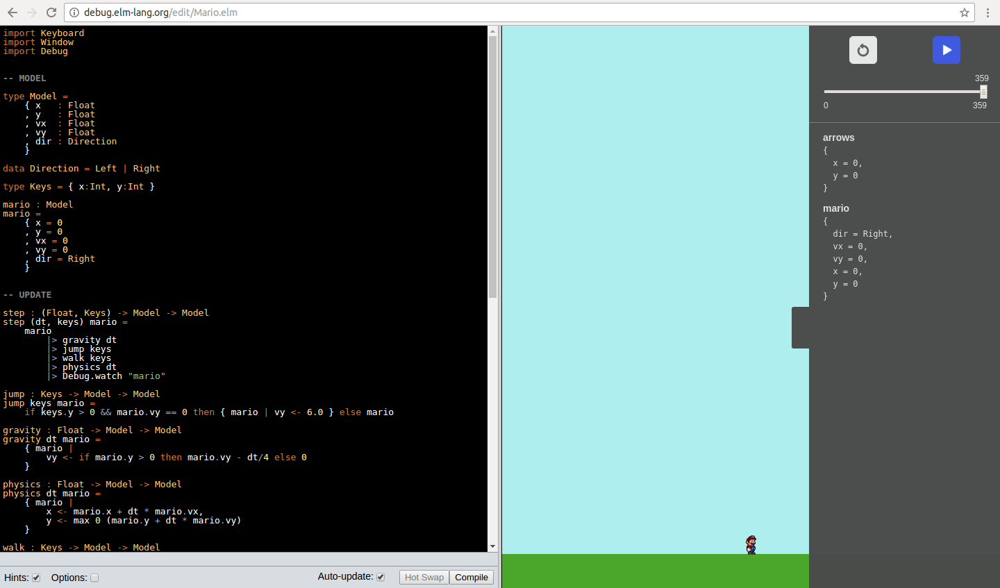

This is the first time-traveling Elm debugger which was published first with Elm 0.12 and the Elm `core` package in version 1.0.0. Later, the time-traveling features were removed from the `core/Debug` package in version 4.0.0 (compare [http://package.elm-lang.org/packages/elm-lang/core/3.0.0/Debug](http://package.elm-lang.org/packages/elm-lang/core/3.0.0/Debug) and [http://package.elm-lang.org/packages/elm-lang/core/4.0.0/Debug](http://package.elm-lang.org/packages/elm-lang/core/4.0.0/Debug)).
In the GitHub issue [https://github.com/elm-lang/elm-reactor/issues/186](https://github.com/elm-lang/elm-reactor/issues/186) Evan Czaplicki, the designer of Elm, said that the features were removed because "[it] was not possible to fit all the upgrades into Elm 0.17" whereas upgrades refers to, among others, the time-traveling features of the debugger.
Due to dependency issues and fast changes in the Elm language itself as well as in its packages, it is now hard to create an Elm setup that is capable of running this time-traveling Debugger.
Nevertheless, this Debugger is deployed at [http://debug.elm-lang.org/](http://debug.elm-lang.org/) and can be tried out there. The site provides three examples that make use of the `core/Debug` package.
The tool is structured as follows:
 - Leftmost, there is an editor that shows Elm source code. The source code can be changed. Adaption takes place automatically as the user types.
 - In the middle, there is an area that shows the web page generated by the source code.
 - Rightmost, there is an area that shows two buttons, a slider and a pane for observed variables.
   - The sliders purpose is scrolling through the input history. Input can be timer events, mouse movements, clicks, as well as keyboard input. The examples source code decides which input is relevant. If the Elm application under observation only listens on mouse input, everything but mouse input is ignored. The slider can be used to revert and replay input.
  - Of the two buttons, one is for pausing the execution in terms of not accepting input anymore. By clicking the button again, the execution is resumed.
  - The other button is for clearing the input history.
  - The pane for observed variables shows the content of these variables at the current point in input history. The pane does not show the whole state of the application. Only variables that are selected using the `Debug.watch` statement in the source code.


#### jinjor/elm-time-travel

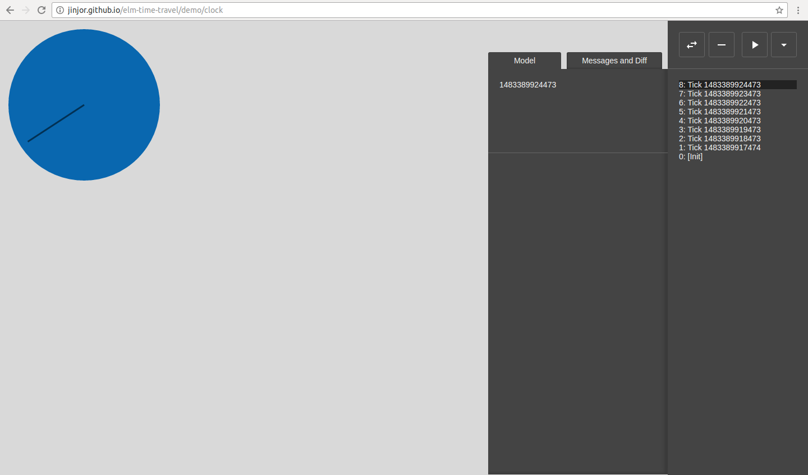

After the time-traveling features were removed from `core/Debug`, there was no time-traveling Debugger in Elm anymore. Therefore Yosuke Torii (jinjor) created the package `jinjor/elm-time-travel` which is based on Elm 0.17 and aims for being a replacement for `core/Debug`. Examples using this package are deployed at [http://jinjor.github.io/elm-time-travel/](http://jinjor.github.io/elm-time-travel/). Comparing this site with [http://debug.elm-lang.org/](http://debug.elm-lang.org/) shows, that both have a similar structure despite there are differences.
In contrast to `core/Debug`, this package does not show source code. There is only a two-part view which shows the generated web page on the left and a tool bar on the right. The tool bar does, other than `core/Debug`, not show variables or its content, but only message send (which are corresponding to input). By selecting a very message send, the user can jump to the point in execution where the message send happened. The debugger then pauses the execution and shows the Elm applications complete model before and after the message send happened. Like in `core/Debug`, the message/input history is immutable. Generating more input does not change the history at the point currently inspected but rather appends messages to the history.

#### Runtime Debugger

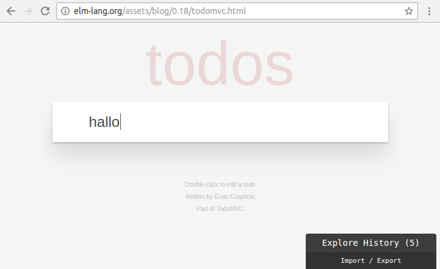
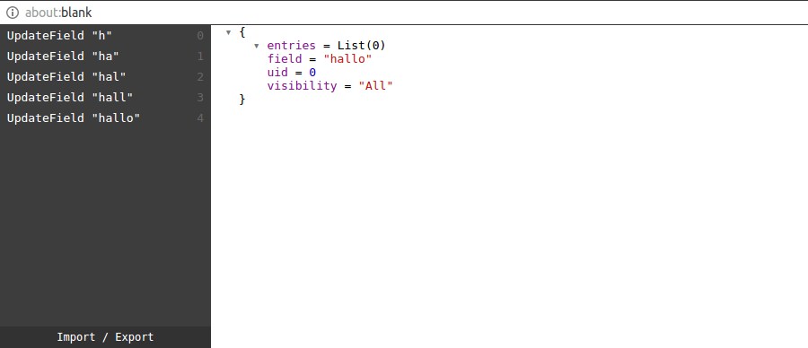

The Elm version 0.18 introduced a debugger that is not a package that can be invoked in the source code but rather part of the runtime environment (see [http://elm-lang.org/blog/the-perfect-bug-report](http://elm-lang.org/blog/the-perfect-bug-report)). The debugger is invoked when the Elm application is built using the Elm Reactor (`elm-reactor`) or Elm Make with debug flag set (`elm-make Application.elm --debug`). The debugger then appears as a box in the bottom right corner of the application under observation. This box has three parts:
 1. The top part is captioned "Explore History" and shows the number of message sends in brackets behind the caption. Clicking on it opens the window described below.
 2. An "Import" button that opens a file dialog where the user can select a history file which is then replayed.
 3. An "Export" button that opens a file dialog where the user can save the current history.

The window that opens when clicking "Explore History" shows the message history on the left. On the right there is an area that displays the model at the time the selected message was send. Also, when selecting a certain message send, the application is brought back to the point when the message send took place.

The idea behind the import/export concept is to create more meaningful and reproducible bug reports. Unfortunately, this deprives the debugger of live development features.

#### Analyzed System
Initially the `core/Debug` package was the system to be analyzed. After finding out about the difficulties of setting up an Elm environment that is capable of running the debugger, we decided to rather analyze the newer Elm runtime debugger. Considerations that led us to that decision were:
 - The time-traveling `core/Debug` package is hard to set up due to the fact that it was built on a much older Elm version which is highly different from the current Elm implementation. We had to use an old Elm version (0.12) which was, other than newer versions, not available via the Node package manager but only via Haskell and Cabal. Since we do not have much knowledge about Haskell and Cabal and moreover ran into dependency conflicts, we assumed it would be easier to make use of another debugger.
 - Even if we were able to set up an old Elm version capable of running the `core/Debug` debugger, the results of our analysis would not be easily reproducible since everyone else would also have to go through the complicated set-up process. Newer version of Elm are easier to set up (using NPM).
 - The development of Elm is really fast-paced. Therefore we argue that using the newest possible version is crucial to make sure the results of our analysis are easily reproducible as long as possible. Using `core/Debug` which is the oldest of the three considered debuggers would contradict this argument.
 - Over time, Elm moved from a Haskell based implementation more and more to JavaScript. With the two newer debuggers (`jinjor/elm-time-travel` and the runtime debugger), there was no need to deal with Haskell or Cabal. We only had to cope with JavaScript and NPM which we considered to be easy since we already had experience with that.

For our analysis we decided use a modified version of the runtime debugger. We could not use the original version because the live programming features (i.e. live reloading and live replaying of history) were removed in favor of saving/loading the history to/from a file.

The following section describes how we changed the runtime debugger to satisfy our needs.

#### Runtime Debugger Modifications
The package that creates the debugger interface is the `elm-lang/virtual-dom` package. Among others, it is responsible for the debugger box in the bottom right corner, the debugger window showing message sends and state of the application, as well as functionality for importing and exporting history including history replay after a history file is loaded.
For enabling live history replay, we did the following:
 1. Add a button "Store" that works like the "Export" button but stores the history in the session storage rather than in a user selected file. Therefore this button provides a one-click functionality.
 2. Add a button "Load" that works like the "Import" button but loads the history from the session storage rather than from a user selected file. Like "Store", this button is also a one-click feature.
 3. Add a window `load` listener that triggers a `click` event on the "Load" button when the page is loaded.
 4. Add a window `beforeunload` listener that triggers a `click` event on the "Store" button when the page about to be left.
 5. Add a "Clear" button that clears the session storage and than reloads the page preventing the `beforeunload` listener to store the history.

The indirection of triggering click events on the "Load" and "Store" buttons is necessary, because calling the functions for loading and storing right away would require creating `load` and `beforeunload` listeners in the Elm source code. Unfortunately we were not able to find any good way of doing this.
All changes took place in `elm-lang/virtual-dom` in version 2.0.2, the most recent version at the time of writing this (2016-12-04). The modified version of the package can be found at [https://github.com/jchromik/virtual-dom](https://github.com/jchromik/virtual-dom) which is a fork of [https://github.com/elm-lang/virtual-dom](https://github.com/elm-lang/virtual-dom).

The following sections describes how the modified debugger can be used.

#### Runtime Debugger Setup
To achieve an impression of liveness inside the Elm runtime debugger, two steps need to be performed:
 1. Exchange the original `elm-lang/virtual-dom` package with the modified one described above.
 2. Apply live reloading on the Elm application.

Exchanging the `elm-lang/virtual-dom` is done as follows: After installing the Elm packages required for your project (these are at least `elm-lang/core`, `elm-lang/html`, and `elm-lang/virtual-dom`), replace the contents of the folder where your copy of `elm-lang/virtual-dom` lies in with the contents of [https://github.com/jchromik/virtual-dom](https://github.com/jchromik/virtual-dom). An `elm-lang/virtual-dom` package in version 2.0.2 should be located in  `elm-stuff/packages/elm-lang/virtual-dom/2.0.2`. The modifications made are based on 2.0.2. Other versions starting with 2 may work as well since there are only minor changes between the versions.
Now live replaying history when refreshing the page should work when using the Elm Reactor. Also, the buttons "Load", "Store", and "Clear" should be visible below the "Import" and "Export" buttons.
The next step describes how to automatically reload the page when a change has happened.

We need to setup a live reload server that watches the files under development and issues a page reload if any file was changed. Also, we need either a script or a browser plug-in, that reloads the page, whenever the live reload server fires.
There are many ways to achieve such a setup. We only describe one possible way.
 1. Install a Node.js based live reload server with `npm install -g livereload` (for more informations see [https://github.com/napcs/node-livereload](https://github.com/napcs/node-livereload))
 2. Install a browser plug-in that listens on the live reload server. We used [http://livereload.com/extensions/](http://livereload.com/extensions/) and installed it on a Chromium Browser from the Google Web Store.
 3. Start the Elm Reactor in your project directory with `elm-reactor`.
 4. Start the live reload server and tell to watch your project directory including Elm files with `livereload /path/to/project -e 'elm'`.
 5. Open a browser, enable the live reload plug-in and visit your project. This is usually on `http://localhost:8000`.
 6. Start developing.

There is an example project at [https://github.com/jchromik/lps16-elm-examples](https://github.com/jchromik/lps16-elm-examples) that shows prerequisites, setup, and start-up process.

### System boundaries
>What have you looked at exactly? Mention the boundaries of the system and state what is included and excluded. For example, in Chrome the system might be the developer tools. This ignores any JavaScript libraries which might add additional live capabilities to the tools or to the page currently developed. Another example are auto-testing setups which span a particular editor, testing framework, and auto-testing tool.

This work studies a modified version of the debugging features introduced in Elm 0.18. The modifications were necessary to enable live programming related features that were not present before. Initially the `core/Debug` debugger which included the aforementioned live programming features was subject to this work. We changed the subject to the runtime debugger. The reasons are listed in the previous section.
The debugging features studied include means of
 - viewing the message history,
 - inspecting the state of the application,
 - going back in time by partially replaying the message history, as well as
 - importing and exporting the message history.

Furthermore we study the features we added, namely:
 - storing history to the session storage
 - loading history from the session storage
 - clearing the history from the session storage
 - live (in terms of automatically) replaying the existing history on page reload
 - live (in terms of automatically) reloading the page if a file has been changed

We do not cover the Elm language itself or any parts related to the execution environment. Operating systems, browsers, and all parts of the Elm execution environment not related to the stated debugging features are not covered.
The focus lies on how the user interacts with the debugger.

### Context
>  - In which context is the system used?
    For example: Application development (coding, debugging, exploration), education, art, science (data exploration), simulation, exploration of ideas or data.
>  - Description of user context
    (professional, amateur, public presentation in front of audience, (un)known requirements, children, ...)

 The context of the system is Application development in general and debugging of Elm applications in special.
 Furthermore the Elm debugger can also be used for understanding the behavior of an application, without any bug involved. Therefore code exploration is also considerable use case.

 The Elm programming language is relatively new and therefore it does not have a large user base. Hence it is not clear how the debugger will be used. Concluding from other programming language and debuggers, the Elm debugger will probably be used for professional and/or amateur software development. We assume an amateur user context is more likely because the user interface is simple and the setup overhead is small while the tool itself is not very feature rich. For a professional context the features of the debugger would be part of a larger development environment.

### General Application Domain
>  - What is typically created in or through this system?
>  - What are users trying to accomplish with it?
>  - What kind of systems are modified or developed with it (graphical application, client-server architecture, big data, streaming)?
>  - ...

Typical output of the system is a bug-free Elm source code file. The features for exporting and importing message history are used for creating meaningful bug reports. With an explicit message history, bugs are easily reproducible which helps finding a bug.  

The user either tries to find a bug in a piece of Elm source code or tries to understand how the source code works. Like in other debuggers too, the goal is understanding why and how an application works.

Subject to the Elm debugger are websites built with Elm. Elm is a functional programming language on top of Node.js. Main use case of Elm is the construction of web user interfaces using a model-view-update ([https://guide.elm-lang.org/architecture/](https://guide.elm-lang.org/architecture/)) pattern.

### Design Goals of the System
>What is the design rational behind the system? Which values are supported by the system? Which parts of the system reflect this rational? For example, auto-testing setups are designed to improve productivity by improving the workflow for TDD through providing feedback on the overall system behavior during programming. Smalltalk systems are designed for expressiveness and enabling understanding through allowing users to directly access and manipulate all runtime objects in the system.

The time-traveling Elm debugger helps understanding, how a specific change in the applications source code affects the applications output in context of the input given by the user.
Although the tool is called a debugger, its main purpose is improving the developers understanding of an application rather than finding bugs.
The time-traveling features help getting a meaningful impression of the connection between change in source code and its effect by providing access to all input that already happened rather than only the current input. Replaying the input helps finding out not only what the change in source code does to the current state, but also what it would have done to every state before.

### Type of System
>What is the general nature of the system? For example: interactive tool, system, library, language, execution environment, application. What makes the system part of that category?

The system is an interactive tool because it is interactive and it is a tool.  
The system is interactive since the user can interact with it. The content shown is not static but changes when the user for example goes back in time by selecting different points in the message history.
The system is a tool because it helps developing Elm applications but is not necessarily required.
Please note, the system under analysis is not the Elm runtime environment. We only analyze the debugging features.

---

## Workflows
>Summary of workflow observations

### Example Workflow
>Description of the major workflow which illustrates all relevant "live programming" features. The workflow description should cover all major elements and interactions available. Augmented by annotated pictures and screencast.

The setup for using the Elm debugger consists of three components.
 1. A text editor for changing the source code of the observed Elm application.
 2. A live reload server for automatically adapting changes in source code.
 3. An Elm setup with modified debugging features.
 4. A browser satisfying the following conditions:
   1. The browser provides a live reload plug-in that listens to the live reload server and reloads the page if the live reload server notices a change in the observed files.
   2. The browser shows the output of the Elm Reactor running the observed Elm application. This is usually served on `http://localhost:8000`.

The browser then shows the Elm application with some additional UI elements for interacting with the debugger. This was already described in the section "About the System itself / Runtime Debugger".

A usual interaction with the system is as follows:
 1. Edit source code using the text editor.
 2. Save the file.
 3. The live reload server notices the files changed and sends an event to the browser plug-in.
 4. The browser plug-in reloads the page.
 5. Before unloading the page for reload, the modified debugger saves the message history to the session storage.
 6. After (re)loading the page, the modified debugger replays the message history from the session storage.

After this cycle the Elm application is in the same situation as before (in terms of input) but with changed source code and therefore potentially changed behavior. Therefore also the state of the application may be different.
Although a change in source code is immediately adapted, it may take some time until changed behavior emerges (see @Rein2016HLL on Adaption and Emergence). Replaying in connection with the users ability to roll back parts of the input helps finding a sequence of user interaction that makes the change emerge. The area in the debugger window showing the applications model helps understanding why a certain behavior occurs.

### Which activities are made live by which mechanisms?
>Description of each concrete activity in the workflow and the underlying liveness mechanism (which is described on a conceptual level and thus could be mapped to other systems)
- Actual interactions
- Feedback mechanism
- If applicable: How is the emergence phase shortened?
- Granularity: For example: Elm can only rerun the complete application

In the cycle of changing code and observing changes behavior can be split in three phases:

#### Editing, recompiling and reloading code
When code is changed and saved, the Elm debugger setup automatically recompiles the code and reloads the application. This happens immediately without the user triggering these actions explicitly. This corresponds to liveness level 4 (see @Tanimoto2013PEL). The adaption time is usually fast (less than 1 second) and may only slow down due to the next phase (replaying input).

#### Replaying input
After recompiling and reloading, the Elm debugger tries to bring the application back to the state it had before. This is tried to achieve by replaying all relevant input. By doing this, the user has the experience as if the change made was always there (past input is processed again by the changed algorithm). This principle is called "mutable past".
The advantage of replaying input rather than restoring the applications state in terms of values bound to variables is avoidance of inconsistencies. We can not assume that the changed application can deal with the same state the application before did. Therefore, the new version of the application has to start off with a blank state and process input made in order to achieve the situation present before the change in source code.
The principle behind this step is "continuous feedback". The user does not have to restore the state themself since the debugger does it for them. This makes programming a continuous process with permanent feedback and permanent correction (cf. @Hancock2003RTP).

#### Observing Emergence
Observing emergence is hard because the time a change needs to emerge depends on the change itself. Although adaption is done quickly, it can take a long time until the application reaches a state where the change emerges. It is also possible that a change does not emerge at all. This happens, for example, when the piece of source code where the change was done is unreachable.
However, the time-traveling features of the Elm debugger make it easier to observe emergence of a change by not only showing the current state but also making all previous states of the application easily accessible. This implies that a change is observable as soon as it effects the application in any state the application was already in. Therefore, the programmer can easily find out if a change made is meaningful for the input that already happened. If there is no evidence for the emergence of the change in context of the previous input, the programmer has to generate further input to provoke emergence.

There may be changes that do not affect the user interface of an application but only change internal, not so easily observable, behavior. The debuggers ability to show the applications state at a given point in the message history helps finding these cases of emergence.

#### Granularity
The smallest granularity of change is the whole application together with all previous input. Whenever the source code of the application is changed, the debugger has to recompile and restart that application together with replaying all input. This may take a long time if the granularity of input is small (e.g. millisecond-wise timer events) and therefore much input happened. This leads to low performance for some kinds of applications.

### Integration of live activities into overall system
>Which activities in the system are not interactive anymore? Which elements can be manipulated in a live fashion and which can not?

The major limitation to the systems liveness is the concept, that every change has to happen through the source code editor. It is neither possible to change the data model from the debugger window nor can the message history be altered, although appending to the message history is of course possible. Also, the applications user interfaces can not be altered from the browser window. Another limitation to the debuggers liveness is the slowdown that happens when there are large amounts of input. If this is the case then input replay requires more time, therefore adaption takes longer and liveness degrades. If the applications source code is syntactically incorrect, liveness interrupts until the code is correct again.  
In summary, it can be stated, that there is only one path that is automated and therefore made live. Namely, editing the source in a manner that it is syntactically correct afterwards, then recompiling and reloading the page, and then doing exactly the same interaction with the application again. Everything else that the debugger does is not live since it only offers different ways of looking at the application running.

>How does this workflow integrate with other parts of the system (potentially not live)? What happens at the boundaries between live parts and non-live parts? For example, the interactively assembled GUI is later passed to a compiler which creates an executable form of the GUI.

  
Browser encapsulates Debugger and Debugger encapsulates Application

There are two borders to the live debugger: the Elm application and the browser. The Elm application, live or not, runs inside the debugger and is not influenced in its behavior. The application behaves just as if the debugger was not present. All the debugger does is logging the message sends and the corresponding state, and all effect the debugger has to the application is the ability to restart it and feed it with parts of the logged input. On the other side, the influence of the (live) browser on the debugger is much stronger. The debugger relies on the session storage which is managed by the browser. Therefore the user can easily influence for example the message history by editing the session storage through the browser. Moreover, most browser provide the ability to change appearance and behavior of the shown website by giving the user access to the source files the page is generated from.  
All in all it can be stated that while the browser has a potentially strong influence on the debugger, the debugger has only a weak influence on the Elm application running inside. The only mean of influencing the debugger has is restarting and replaying input. Model or source code manipulation is not provided.


### Limitations
>To which extend can the liveness of one activity be kept up? For example, at which magnitude of data flow nodes does the propagation of values become non-immediate? At which magnitude of elapsed time can the Elm debugger not replay the application immediately anymore or when does it break down? Does an exception break the liveness?

There are two conditions that confine the Elm debuggers liveness: Large amounts of input and errors in the observed Elm application.  
Large amounts of input are a soft limitation. The liveness does not break apart at a specific amount of input but rather decreases continuously due to the message replay getting slower. According to @Johnson2010DMM there are two relevant thresholds that are crucial to the users experience of waiting time and slowdown: 100ms and 1s. When trying to find a specific number of messages where the liveness breaks apart, we have to find out how many messages are at least required to exceed these thresholds. Doing this, we have to keep in mind that this value depends on the Elm application observed, the messages send (more specific: what the Elm application does if the message is received) and the executing machine.

Whenever there is an error in the observed Elm application, liveness stops immediately and an error message is displayed. Liveness resumes as soon as the error is fixed. This is a hard limitation to the debuggers liveness.

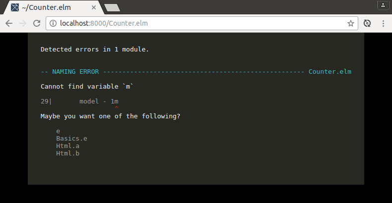

>Further, what are conceptual limitations. For example, in a bi-directional mapping system properties of single elements might be modified and reflected in the code. This might not be possible for properties of elements created in loops.

The major conceptual limitation is that there is no possibility to restore the applications situation by restoring the state. The model is always restored by replaying message sends. This is because the idea behind the debugger is that the user input is the relevant and unchangeable part of a running application. The structure of the model may be changed when the source code is changed and therefore the old state of the application does not work with the new source code. The debugger assumes that, while the model may change, the application will always be able to process the input that already happened in a correct manner. This is why the situation is restored by replaying user input and not by restoring state.  
Another not necessarily conceptual limitation is the absence of direct manipulation. There is no way to influence values in the source code through sliders (only by changing the values in an editor or IDE), the model is not editable, and message send can not be altered. Not even the payload of messages that carry values can be manipulated. The scope of the debugger is clearly only on restoring an applications situation by replaying all logged input.


### What happens when the live parts of the system fail/break?
>1. What happens when the application under development causes an exception? How does the system handle these exceptions (provide debugger, stop execution, stop rendering, ...)? Does the liveness extend to these exceptions?
>2. How can the system itself break? What happens when there is a failure in the system/tool itself?

If the application under development is erroneous, the execution of debugger and observed application is stopped and only an error message is displayed (without any possibility to interact). This behavior is equivalent to the behavior when the Elm debugger is not involved since it is caused by the Elm runtime environment.
When there is an error in the Elm debugger itself, the behavior is the same: An error message is shown and the execution stops. In both cases the execution resumes as soon as the error is fixed.  
If there is an error and the liveness interrupts, there is still the browsers debugger that can be used as a fallback system. But since the code generating the page is compiled Elm source code, it is not easily understandable and requires advanced knowledge about the domain.

### Left out features
>Which features of the system were not described and why were they left out?

There are no features that are part of the debugger but left out. However we did not cover the Elm runtime environment, browsers or made any assumption about the observed Elm applications. The scope of this work only contains the Elm debugger and nothing in scope was left out.

---

## Models

### Mutable or immutable past
>To which category does the system or parts of it belong and why?

The system is a mutable past system because changes in source code may influence the current state, as well as previous state that are reachable by going back in the message history. This happens because the Elm debugger restores state by replaying input. If a change in the observed applications source code does affect the initial state or the way the applications deals with input, the current state together with all past states will be altered.

*P. Rein and S. Lehmann and Toni & R. Hirschfeld How Live Are Live Programming Systems?: Benchmarking the Response Times of Live Programming Environments Proceedings of the Programming Experience Workshop (PX/16) 2016, ACM, 2016, 1-8*

### Tanimoto's Level of Live Programming
>To which level of liveness do single activities belong, based on the definitions of the 2013 paper and why?

The system provides level 4 liveness. According to @Tanimoto2013PEL in level 4 liveness "[...] the computer wouldn’t wait but would keep running the program, modifying the behavior as specified by the programmer as soon as changes were made". This is exactly what the Elm debugger does. As opposed to liveness level 3 where there is waiting time between a change the programmer made and the corresponding effect. The Elm debugger would provide level 3 liveness if it was not event driven but using polling with a significantly long turn around time. Level 5 is also not the level of liveness the system provides because level 5 would include tactical prediction. The Elm debugger itself does not predict anything. There may be an IDE or text editor in use that tries to predict what the programmer wants to do and gives a selection of options. But since the IDE or text editor in use is not part of the Elm debugger by our definition, this does not count as liveness level 5.

*S. L. Tanimoto A perspective on the evolution of live programming Proceedings of the 1st International Workshop on Live Programming, LIVE 2013, 2013, 31-34*

### Steady Frame
>Which activities are designed as steady frames based on the formal definition and how?

@Hancock2003RTP defines "steady frame" as follows:

> A steady frame is a way of organizing and representing a system or activity, such that
>  1. relevant variables can be seen and/or manipulated at specific locations within the scene (the framing part), and
>  2. these variables are defined and presented so as to be constantly present and constantly meaningful (the steady part).

The relevant "steady frame" variable in context of the Elm debugger is the message history. The message history is stored in the session storage (a specific location within the scene). Also, the message history is constantly present, as the session storage persists between the page reloads, and constantly meaningful, because only valid message histories are stored in the session storage.

*C. M. Hancock Real-Time Programming and the Big Ideas of Computational Literacy Massachusetts Institute of Technology, Massachusetts Institute of Technology, 2003*

### Impact on distances
>How do the activities affect the different distances: temporal, spatial, semantic?

#### Temporal distances
Temporal distances emerge whenever the liveness is disturbed. As mentioned before, there are two situations in which the liveness is disturbed: large amounts of input and erroneous code.
Large amounts of input lead to long replay times which creates a significant temporal distance between change in source code and observable change in the running application (long adaption time).
Erroneous code stops the debuggers and the applications execution. During this time period, the debugger is not present. Therefore there is a temporal distance that lasts as long as it takes to fix the error.

#### Spatial distances
When changing between interacting with the observed application and interacting with the debugger, there may be a spatial difference. This happens when the application is left aligned and mostly occupies the top part of the window. This happens automatically when creating a web page without styling. The spatial difference emerges because the debugger controls are always at the bottom right corner and therefore as far as possible form the applications content away.

#### Semantic distances
Editing the source code and afterwards observing the effect creates a semantic distance due to the fact that editing happens in an editor while observing the effect happens in a web browser.  
Another activity creating a significant semantic distance is inspecting the message history and/or the corresponding state. This is achieved by clicking on the "Explore History" button in the debugger control box. This opens a separate window showing the message history. Having the history in a separate window leads to a high semantic distance between application and message history.

*D. Ungar and H. Lieberman & C. Fry Debugging and the Experience of Immediacy Communications of the ACM, ACM, 1997, 40, 38-43*

---

## Implementing Liveness

### Extend of liveness in technical artifacts
>What parts of the system implements the liveness? (Execution environment, library, tool...)

The system contains two parts that enable liveness: Live reloading and live replaying history.  
Live reloading is enabled by a external tools that are not related to Elm and only used _together with_ Elm. The tools in use are a live reload server that watches the Elm files of the observed application and a live reload browser plug-in that reloads the page whenever the live reload server recognized a change.  
Live replaying history is enabled by the `elm-lang/virtual-dom` package. Although this package is treated as every other Elm package, it is actually an integral part of the Elm runtime environment (like `elm-lang/core` and `elm-lang/html`).  
Please note that is only applies to the modified version of `elm-lang/virtual-dom` which can be found at [https://github.com/jchromik/virtual-dom](https://github.com/jchromik/virtual-dom). The original `elm-lang/virtual-dom` package was not able to replay history automatically on page reload.

### Implementations of single activities
>Description of the implementation of live activities. Each implementation pattern should be described through its concrete incarnation in the system (including detailed and specific code or code references) and as an abstract concept.

#### Live reloading
Live reloading is implemented through utilization of a live reload server and a live reload plug-in. The live reload server can be installed with:
```
npm install -g livereload
```
This requires an existing Node.js installation.
After installation, the live reload server has to be started. Doing this, we have to tell the server firstly, which path has to be watched, and secondly, to watch Elm files as well (this is not enabled by default). The following command does this:
```
livereload /path/to/project -e 'elm'
```
Now the live reload server is up and running. Now we need to install the live reload plug-in, which receives a notification from the live reload server whenever a file to be watched changes. Subsequently, the plug-in reloads the page. Using the Chromium web browser, install the plug-in "LiveReload" (we used version 2.1.0). Then visit the web page showing the Elm application (usually `http://localhost:8000`) and enable the plug-in by clicking on the button next to the address bar.
Now live reloading is enabled.

  
Live reload plug-in installation page

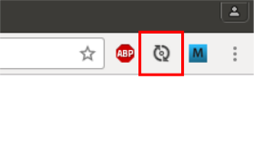  
Live reload button next to the address bar

The concept behind this is live reloading. This means adapting changes in source code immediately by reloading the page whenever any of the source files has changed. This is an event-driven concept.

#### Live replaying
Implementing live replaying requires implementing a store and a load phase. When the page is reloaded, the store function is called before the page is unloaded and the load function is called when the page is loaded again.
The store function saves the message history to the session storage as JSON. The load function gets the message history from the session storage and then send each message contained to simulate the user interaction that happened before.
The concrete implementation of storing and loading is quite complex since it requires heavy interoperability between Elm and JavaScript.  
Storing works as follows:
##### 1. Event when unloading page
A `window.beforeunload` listener simulates a button click event on the "Store" button. This is implemented in JavaScript since Elm does not support load/unload/beforeunload listener.  
Relevant part in `src/Native/VirtualDom.js`:
```javascript
window.addEventListener('beforeunload', function(event) {
  document.getElementById("store").click();
});
```
##### 2. How the "Store" button works
The "Store" button sends the `storeMsg` specified in a `Config` data structure.
Button creation in function `viewImportExport` in `src/VirtualDom/Overlay.elm`:
```elm
button storeMsg "Store" "store"
```
The function `button` is created in the same file:
```elm
button : msg -> String -> String -> Node msg
button msg label identifier =
  span [ onClick msg, style [("cursor","pointer")], id identifier ] [ text label ]
```
This shows that the button is actually implemented as a `span` element. When the `span` element is clicked, the Message `msg` is send.  
The `storeMsg` mentioned above is defined in `src/VirtualDom/Debug.elm` inside a `Config` data structure:
```elm
overlayConfig : Overlay.Config (Msg msg)
overlayConfig =
  { resume = Resume
  , open = Open
  , importHistory = Import
  , exportHistory = Export
  , loadHistory = Load
  , storeHistory = Store
  , clearHistory = Clear
  , wrap = OverlayMsg
  }
```
Therefore a click on the "Store" button sends the message `Store`.
##### 3. What happens when the `Store` message is send
The `Store` message is then processed by the function `wrapUpdate` which is also defined in `src/VirtualDom/Debug.elm`. The relevant part is that a function `store` is called and provided metadata and (even more important) the message history.
```elm
Store ->
  withGoodMetadata model <| \metadata ->
    model ! [ store metadata model.history ]
```
The function `store` then makes a transition to a function defined in the JavaScript part (`Native.Debug.store`):
```elm
store : Metadata -> History model msg -> Cmd (Msg msg)
store metadata history =
  let
    historyLength =
      History.size history

    json =
      Encode.object
        [ ("metadata", Metadata.encode metadata)
        , ("history", History.encode history)
        ]
  in
    Task.perform (\_ -> NoOp) (Native.Debug.store historyLength json)
```
##### 4. The `store` function in JavaScript
This function is defined in `src/Native/Debug.js`. It stores the message history (provided in the argument `json`) in the session storage (as `elmHistory`).
```javascript
function store(historyLength, json)
{
	return _elm_lang$core$Native_Scheduler.nativeBinding(function(callback)
	{
		if(!sessionStorage.getItem("elmDoNotStore")) {
			sessionStorage.setItem("elmHistory", JSON.stringify(json));
		}
		sessionStorage.removeItem("elmDoNotStore");
	});
}
```

---

Loading works as follows:
##### 1. Event when loading page
A `window.load` listener simulates a button click event on the "Load" button. This is implemented in JavaScript since Elm does not support load/unload/beforeunload listener.  
Relevant part in `src/Native/VirtualDom.js`:
```javascript
window.addEventListener("load", function(event) {
	setTimeout(function(){
		document.getElementById("load").click();
	},200);
});
```
The delay of 200ms makes sure that the "Load" button has its click event listener readily registered.
##### 2. How the "Load" button works
The "Load" button sends the `loadMsg` specified in a `Config` data structure.
Button creation in function `viewImportExport` in `src/VirtualDom/Overlay.elm`:
```elm
button loadMsg "Load" "load"
```
The function `button` is created in the same file:
```elm
button : msg -> String -> String -> Node msg
button msg label identifier =
  span [ onClick msg, style [("cursor","pointer")], id identifier ] [ text label ]
```
This shows that the button is actually implemented as a `span` element. When the `span` element is clicked, the Message `msg` is send.  
The `loadMsg` mentioned above is defined in `src/VirtualDom/Debug.elm` inside a `Config` data structure:
```elm
overlayConfig : Overlay.Config (Msg msg)
overlayConfig =
  { resume = Resume
  , open = Open
  , importHistory = Import
  , exportHistory = Export
  , loadHistory = Load
  , storeHistory = Store
  , clearHistory = Clear
  , wrap = OverlayMsg
  }
```
Therefore a click on the "Load" button sends the message `Load`.
##### 3. What happens when the `Load` message is send
The `Load` message is then processed by the function `wrapUpdate` which is also defined in `src/VirtualDom/Debug.elm`. The relevant part is that a function `load` is called.
```elm
Load ->
  withGoodMetadata model <| \_ ->
    model ! [ load ]
```
The function `load` then makes a transition to a function defined in the JavaScript part (`Native.Debug.load`) and sends the result as payload of another message (`Upload`):
```elm
load : Cmd (Msg msg)
load =
  Task.perform Upload Native.Debug.load
```
##### 4. The `load` function in JavaScript
This function is defined in `src/Native/Debug.js`. It loads the message history from the session storage and passes it back to Elm using a callback.
```javascript
var load = _elm_lang$core$Native_Scheduler.nativeBinding(function(callback)
{
	var elmHistory = sessionStorage.getItem("elmHistory");
	if(elmHistory) {
		callback(_elm_lang$core$Native_Scheduler.succeed(elmHistory));
	}
});
```
##### 5. Applying the message history
The Elm function `load` sent a message `Upload` with the result of the JavaScript function `load`. Now we have a look at what happens when `Upload` is received. Again, `wrapUpdate` is the function dealing with the message:
```elm
Upload jsonString ->
  withGoodMetadata model <| \metadata ->
    case Overlay.assessImport metadata jsonString of
      Err newOverlay ->
        { model | overlay = newOverlay } ! []

      Ok rawHistory ->
        loadNewHistory rawHistory userUpdate model
```
The argument `jsonString` contains the message history. The message history is unpacked using the function `assessImport` defined in `src/VirtualDom/Overlay.elm`. `assessImport` either successfully unpacks the history and provides the `rawHistory` in a native Elm data format, or it fails and returns an error message. On success, the history is replayed by the function `loadNewHistory`.


The concept behind replaying the history is the following. The debugger keeps track of everything that the user does to the application in a history. When the application is reloaded (see "Live reloading", the previous section), the history is stored in a way that it persists the reloading. After reloading, the application is in a blank state. To bring the application back to the situation it was in before reloading, every element of the history has to be applied in order. We purposely use the term "situation" because the state can be different to the state before reloading. This happens, when the changes made to the application affect the model or the way the model is updated.


#### Example: Scrubbing
>The mouse event in the editor is captured and if the underlying AST element allows for scrubbing a slider is rendered. On changing the slider the value in the source code is adjusted, the method including the value is recompiled. After the method was compiled and installed in the class, the execution continues. When the method is executed during stepping the effects of the modified value become apparent.

>Abstract form: Scrubbing is enabled through incremental compilation which enables quick recompilation of parts of an application...

### Within or outside of the application
>For each activity: Does the activity happen from within the running application or is it made possible from something outside of the application? For example, a REPL works within a running process while the interactions with an auto test runner are based on re-running the application from the outside without any interactive access to process internal data.

#### Live reloading
When the system is the Elm debugger, live reloading happens from outside the system. There is an extra service that watches the files under development that is completely separated from the debugger itself. The browser plug-in that reloads the page when the service notifies it is also not part of the debugger. Both are components that are build _around_ the analyzed system itself. They are crucial for the system to work as intended, though. This is equivalent to the presence of browsers and operating systems being prerequisites for the Elm debugger.

#### Live replaying
Live replaying is part of the debugger itself. As described above, it is implemented in the `elm-lang/virtual-dom` package, which also provides all other parts of the debugger.

---

## Benchmark
>1. **Unit of change:** Determine relevant units of change from the user perspective. Use the most common ones.
>2. **Relevant operations:** Determine relevant operations on these units of change (add, modify, delete, compound operations (for example refactorings)).
>3. **Example data:** Select, describe, and provide representative code samples which reflect the complexity or length of a common unit of change of the environment. The sample should also work in combination with any emergence mechanisms of the environment, for example a replay system works well for a system with user inputs and does not match a long-running computation.
>4. **Reproducible setup of system and benchmark**
  1. Description of installation on Ubuntu 16.04.1 LTS
  2. Description of instrumentation of system for measurements: The measurements should be taken as if a user was actually using a system. So the starting point of a measurement might be the keyboard event of the save keyboard shortcut or the event handler of a save button. At the same time the emergence phase ends when the rendering has finished and the result is perceivable. The run should include all activities which would be triggered when a developer saves a unit of change (for example regarding logging or persisting changes).
>5. **Results for adaptation and emergence phase**

### Unit of change
There are two relevant units of change: the message history and source code files.
The message history can only be altered by appending new elements to it. This is made by normally interacting with the application. There is no behavioral difference to executing the application without the debugger. The distinctiveness lies in the debugger keeping track of input happening to the application. This is only relevant in context of replaying the history for the purpose of bringing the application to a specific situation it was in before.
Changing source code files is the way of the programmer influencing the behavior of the application. When a file belonging to the application has been changed, the module the file belongs to is recompiled. Unlike Smalltalk, there is no way of partially recompiling only the changed part (like a single method). Elm clearly operates on a file level as smallest level of granularity.

### Relevant operations
On the message history only appending and clearing is possible. Appending is done by interacting with the application or (for some applications) by waiting for a timer to fire. Clearing is performed through a clear button that simply empties the message history. It is also possible to import a message history from file or to save the currently loaded message history to file. This feature is intended to make bug more reproducible for it makes clear which sequence of events has lead to the bug emerging.  
On source code files every operations that can be performed on files are relevant, i.e. adding, deleting, modifying, as well as combinations of the aforementioned. When adding features to the application or building an previously non-existent application from scratch, adding (characters, lines, functions, ...) is the predominant operation. When refactoring or searching for bugs, all operations are relevant.

### Example data
#### Message history
The message history is a JSON string that looks like this:
```json
{
  "metadata":{
    "versions":{
      "elm":"0.18.0"
    },
    "types":{
      "message":"Main.Msg",
      "aliases":{

      },
      "unions":{
        "Main.Msg":{
          "args":[

          ],
          "tags":{
            "Decrement":[

            ],
            "Increment":[

            ]
          }
        }
      }
    }
  },
  "history":[
    {
      "ctor":"Increment"
    },
    {
      "ctor":"Increment"
    },
    {
      "ctor":"Increment"
    },
    {
      "ctor":"Decrement"
    }
  ]
}
```
The message history has two parts: metadata and history. The metadata define the version of the Elm runtime environment (`metadata.versions.elm`) and types of messages in use. The value `Main.Msg` in `metadata.types.message` is a so called union type that defines which message are existent in the applications context. Union types define a set of values a variable of this type can accept. In this case `Main.Msg` is defined as `type Msg = Increment | Decrement` which means that the messages `Increment` and `Decrement` can be sent. `metadata.types.aliases` is empty and would be occupied if any type aliases would be occupied if there were any type aliases in use for message sends relevant to the message history. In `metadata.types.unions`, `Main.Msg` is described. `metadata.types.unions.args` is for type variables when creating generic union types. `metadata.types.unions.tags` contains the values `Main.Msg` variables can have, for this application `Increment` and `Decrement`. The array behind the tags is for the type of data that are passed together with the type. `Increment` and `Decrement` do not have any data passed with but there are cases where not only a keyword is sent but also data.
More on the topic of union types can be found here: [https://guide.elm-lang.org/types/union_types.html](https://guide.elm-lang.org/types/union_types.html).
The history part of the message history contains the messages sent. The message are applied top to bottom. The field `ctor` contains the keyword. If there are data passed together with the keyword, the data are provided together with the keyword in the object that encapsulates the `ctor` field.

#### Source code files
The Elm source code for an application that generates the message history shown above is the following:
```elm
import Html exposing (Html, button, div, text)
import Html.Events exposing (onClick)


main =
  Html.beginnerProgram { model = model, view = view, update = update }


-- MODEL

type alias Model = Int

model : Model
model =
  0


-- UPDATE

type Msg = Increment | Decrement

update : Msg -> Model -> Model
update msg model =
  case msg of
    Increment ->
      model + 1

    Decrement ->
      model - 1


-- VIEW

view : Model -> Html Msg
view model =
  div []
    [ button [ onClick Decrement ] [ text "-" ]
    , div [] [ text (toString model) ]
    , button [ onClick Increment ] [ text "+" ]
    ]
```
As one can see a model-view-update pattern is used which is typical for Elm applications. Also, there is no debugger package imported explicitly through the applications source code. This is a major difference between the runtime debugger we analyzed in this work and the two other debuggers mentioned at the beginning. The Elm source code does not have to be changed in order to use the debugger. In the following we will provide an explanation of the source code.
The application creates a simple counter with three elements, an area that shows the current value of the counter and two buttons, one for incrementing and one for decrementing the counter.

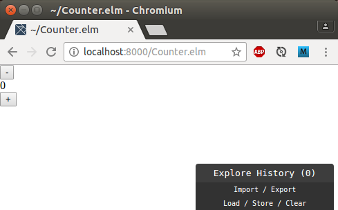  
Simple counter application with debugger box in the bottom right corner

The first two lines are for importing elements we want to use in the application. The statement `main = Html.beginnerProgram { ... }` assembles a simple web page out of the components model, view, and update we define below. Our model is a simple integer number that stores the counters value. Initially the value is 0. The update part has a type `Msg` that allows two messages for updating the model: `Increment` and `Decrement`. After defining this type, the function `update` defines what the effects of receiving these messages are. I.e., receiving `Increment` increments the model and receiving `Decrement` decrements the model. The view part defines the graphical representation and the way the user interacts with the application. It creates a text area that shows the model and two buttons, one with a "+" on it that sends the `Increment` message when clicked and one with a "-" on it that sends the `Decrement` message when clicked.
The messages `Increment` and `Decrement` are the same messages that appear in the message history. The type that defines these messages, `Msg` or more specifically `Main.Msg`, also appears there.

### Setup of the System
On a freshly set up Ubuntu 16.04.1 LTS the following steps have to be performed in order to achieve a up and running Elm debugger setup with observed Elm application. (Note that there are many alternative ways. We only describe one.)

#### 1. Install Technology Stack
 1. Install Node.js together with the Node Package Manager (NPM) via APT: `sudo apt install nodejs npm`
 2. Install the Elm platform at version 0.18 via NPM: `sudo npm install -g elm@0.18`
 3. Install the live reload server via NPM: `sudo npm install -g livereload`
 4. Install the Chromium browser via APT: `sudo apt install chromium-browser`
 5. Install the live reload plug-in via the Chrome Web Store: Visit [https://chrome.google.com/webstore/detail/livereload/jnihajbhpnppcggbcgedagnkighmdlei](https://chrome.google.com/webstore/detail/livereload/jnihajbhpnppcggbcgedagnkighmdlei) with the Chromium browser and click the "ADD TO CHROME" button.

#### 2. Set up Project
For using the Elm debugger, you need an Elm project that is to be debugged. There are three options:
 1. You already have an existing project on which you want to try the debugger.
 2. You do not have a project at hand, but you know Elm and can easily create a project.
 3. You do not have a project and do not know Elm.

If you already have a project change to the project folder. Have a look at the `elm-package.json` and make sure `elm-lang/virtual-dom` is part of the dependency specification and fixed on version 2.0.2. If you changed something, rerun `elm-package install`.  
If you do not have a project at hand but know Elm, change to a folder where you want to create your project in. Create at least one Elm file where your code goes in. Afterwards run `elm-package install` to install dependencies and `elm-reactor` to start your Elm application once for making sure your Elm setup works. Now have a look at the `elm-package.json` and add `"elm-lang/virtual-dom": "2.0.2 <= v < 2.0.3"` to the `dependencies` object. If `"elm-lang/virtual-dom"` is already key to the `dependencies` object, alter the value to match the aforementioned key-value pair.  
If you do not know Elm, you can check out an example project from GitHub. Change to the folder your experiments may take place in and execute `git clone https://github.com/jchromik/lps16-elm-examples.git`. Afterwards execute `elm-package install`. You do not have to alter the `elm-package.json`, it is already configured to use the correct version of `elm-lang/virtual-dom`.

#### 3. Replace `elm-lang/virtual-dom`
From your Elm project folder, change to the folder the `elm-lang/virtual-dom` package is located in: `cd elm-stuff/packages/elm-lang/virtual-dom`. Then delete the folder 2.0.2: `rm -rf 2.0.2`. Now clone a modified version of `elm-lang/virtual-dom` in the folder just deleted: `git clone https://github.com/jchromik/virtual-dom.git 2.0.2`. You have now successfully replaced the original package with a modified fork.

Hint: When you are using the example project form GitHub, you can just run `setup.sh`. This installs the correct Elm packages and replaces `elm-lang/virtual-dom`.

#### 4. Start Everything
All commands have to take place in your Elm project directory.
 1. Start the Elm Reactor: `elm-reactor`
 2. Start the live reload server: `livereload . -e 'elm'`
 3. Start the Chromium browser.
 4. Got to `localhost:8000`.
 5. Select Elm file (Counter.elm or OnlyNumbers.elm if you are using the example project).
 6. Enable live reload plug-in by clicking on the button in the top-right corner of the browser window.
 7. Start editing the selected Elm file.

Hint: The example project contains scripts for starting and stopping Elm Reactor and live reload server at once.

### Setup of the Benchmark
We are benchmarking the runtime of a single development cycle. The cycle includes everything that happens between the programmer saving changed source code and the end of the adaption phase, i.e. recompiling, reloading, and replaying. For benchmarking this we log the time the Elm application starts reloading (through a `beforeunload` listener) and log the time again when the history is completely replayed. Our start time is the time the page starts reloading, because the debugger itself has no influence on everything that happens prior to this. If the live reload server, the live reload plug-in, or the browser itself need much time for propagating the event saying that a source file has been changed, this is not a performance issue of the Elm debugger and therefore not to be benchmarked.  
The benchmark was performed by a shell script which touched the source code file under observation 100 times with a waiting period of three seconds between the file operations. The waiting period is three seconds long because we found out, that one cycle usually takes less than one second. Choosing a three second waiting period ensured that the file is certainly not touched while the adaption cycle is still running.
Using this setup we get a log file with pairs of timestamps: start and end of the cycle. By calculating the difference between these timestamps we get the runtime of the Elm debugger for one cycle. This calculation as well as parsing the log is done by a small python script. Chart generation is done with R.
Log files, benchmarking shell script, and analyzation scripts can be found at [https://github.com/jchromik/lps16-elm-examples](https://github.com/jchromik/lps16-elm-examples). The `elm-lang/virtual-dom` modifications for logging benchmark result can be found on branch `benchmark` in [https://github.com/jchromik/virtual-dom](https://github.com/jchromik/virtual-dom).

Benchmarks we performed:
 1. On Counter application: User can increment/decrement a counter. Model update correspondingly `model+1` or `model-1`.
   1. Predictable input: Only decrementing. Denoted as: "*counter predictable*"
   2. Unpredictable input: Randomly chosen sequence of increment and decrement. Denoted as: "*counter unpredictable*"
 2. On OnlyNumbers application: User gives a sequence of characters and the application filters for numbers (digits). Model update is string filter operation.
   1. Predictable input, keep all: Repeated input of a single digit character. For example: '1'. Denoted as: "*onlynumbers predictable keep*"
   2. Predictable input, reject all: Repeated input of a single non-digit character. For example: 'a'. Denoted as: "*onlynumbers predictable reject*"
   3. Unpredictable input: Randomly chosen sequence of various characters. Denoted as: "*onlynumbers unpredictable*"

In the following we show how we programmatically generated input for the benchmarks.  
1.1. counter predictable:
```javascript
for(var i=0; i<numMessages; i++) {
  elmHistory.history.push({"ctor":"Increment"});
}
```
1.2. counter unpredictable
```javascript
for(var i=0; i<numMessages; i++) {
  if(Math.floor(Math.random()*2) == 0) {
    elmHistory.history.push({"ctor":"Increment"});
  } else {
    elmHistory.history.push({"ctor":"Decrement"});
  }
}
```
2.1. onlynumbers predictable keep
```javascript
for(var i=0; i<numMessages; i++) {
  elmHistory.history.push({"ctor":"Change","_0":"1"});
}
```
2.2. onlynumbers predictable reject
```javascript
for(var i=0; i<numMessages; i++) {
  elmHistory.history.push({"ctor":"Change","_0":"a"});
}
```
2.3. onlynumbers unpredictable
```javascript
for(var i=0; i<numMessages; i++) {
  if(Math.floor(Math.random()*2) == 0) {
    elmHistory.history.push({"ctor":"Change","_0":"1"});
  } else {
    elmHistory.history.push({"ctor":"Change","_0":"a"});
  }
}
```

### Benchmark Results

The following charts show the runtime data generated by the benchmark:

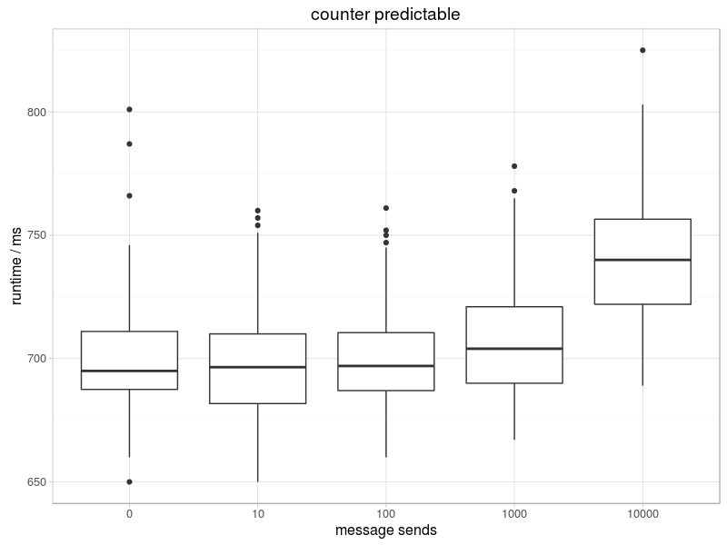

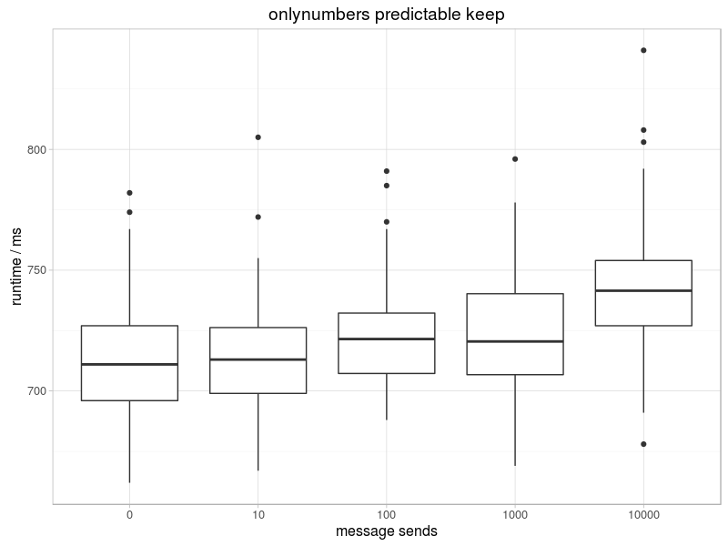
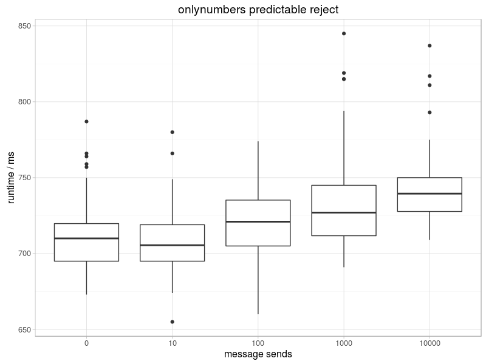
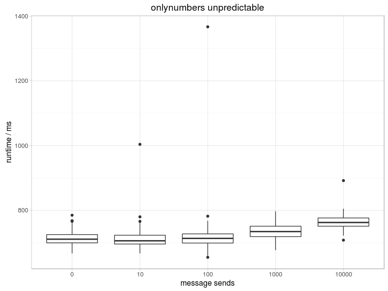

The charts show that replaying a history with 10000 messages takes less than 100 millisecond for all combinations of application type, input type, and amount of input we considered. Furthermore, all combinations show a adaption time of less than 1 second, which is below the threshold @Johnson2010DMM describes to be the "maximum duration of silent gap between turns in person-to-person
conversation" which also should not be exceeded by an application processing input without any feedback mechanism showing the progress.
From these two facts we can conclude that the Elm debugger is fast enough to enable live programming. Nevertheless, liveness can break apart if the application under observation need relatively much time to process input. In this case, replaying history takes much longer and the experience of immediacy will vanish.

For all combinations between application type (`counter` and `onlynumber`), input type (`predictable`, `unpredictable`, ...) and amount of input (0 messages, 10 messages, ..., 10000 messages) we took 100 observations. Therefore each box (including whiskers and outliers) represents 100 data points.

All tests were performed on a system with the following specifications:
 - Intel Core i5 CPU M 560 @ 2.67GHz, 4 logical cores
 - 7,6 GiB main memory
 - Ubuntu 16.04 LTS operating system

*P. Rein and S. Lehmann and Toni & R. Hirschfeld How Live Are Live Programming Systems?: Benchmarking the Response Times of Live Programming Environments Proceedings of the Programming Experience Workshop (PX/16) 2016, ACM, 2016, 1-8*

---

## Personal observations
>Everything that is particular about the environment and does not fit into the pre-defined categories mentioned so far.

### Terminological clarification
In this work we use the terms "history", "message history", and "input history" interchangeable. What we mean with all these terms, is a record of events that trigger model updates. This may be input generated by the user (e.g. clicking on a button or moving the mouse) but can also be a timer firing without the user being involved. Neither the term "message history" nor "input history" is completely accurate. "Message history" is inaccurate because there are many message sends in the Elm application that are not recorded in the message history because they do not _trigger_ model updates. They are just part of a progression of things happening after some triggering action (e.g. the messages `Store`, `Load`, and `Upload` described above). "Input history" is not accurate since it is not only input which is kept in the history. For example, if there is a timer that fires periodically without any user involved, the timer events would also be kept in the history.

## Style Template
>- Denote headings with #
>- You can use any text highlighting, list types, and tables
>- Insert images in the following way:
>  ``
>- Insert videos or web resources as markdown links
>- Insert references as: `@RefKey` and supply a bib file
>- No HTML tags please
